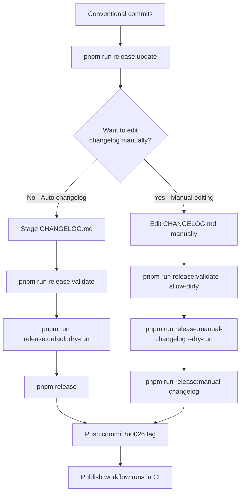

# @oorabona/release-it-preset

Shared [release-it](https://github.com/release-it/release-it) configuration and scripts for automated versioning, changelog generation, and package publishing.

[](https://codecov.io/github/oorabona/release-it-preset)
[](https://github.com/oorabona/release-it-preset/actions/workflows/ci.yml)
[](https://npmjs.org/package/@oorabona/release-it-preset)
[](https://npmjs.org/package/@oorabona/release-it-preset)
[](https://www.typescriptlang.org/)
[](https://opensource.org/licenses/MIT)

## Features

- 📦 Multiple release configurations for different scenarios
- 📝 Automatic changelog generation using [Keep a Changelog](https://keepachangelog.com/) format
- 🤖 Conventional commits parsing and categorization
- 🏷️ Git tagging with optional GitHub release automation
- 🚀 npm publishing with provenance (opt-in, ideal for CI)
- 🔄 Republish and retry mechanisms for failed releases
- ⚡ Hotfix release support
- 🎯 Environment variable configuration

## Installation

```bash
pnpm add -D @oorabona/release-it-preset release-it
```

## Quick Start

### Option 1: Using the CLI (Recommended)

Add scripts to your `package.json`:

```json
{
  "scripts": {
    "release": "release-it-preset default",
    "release:hotfix": "release-it-preset hotfix"
  }
}
```

Then run:

```bash
pnpm release
```

### Option 2: Using extends

Create `.release-it.json` in your project:

```json
{
  "extends": "@oorabona/release-it-preset/config/default"
}
```

Add scripts to your `package.json`:

```json
{
  "scripts": {
    "release": "release-it"
  }
}
```

### Initialize CHANGELOG.md

Create a `CHANGELOG.md` file with Keep a Changelog format:

```markdown
# Changelog

All notable changes to this project will be documented in this file.

The format is based on [Keep a Changelog](https://keepachangelog.com/en/1.1.0/),
and this project adheres to [Semantic Versioning](https://semver.org/spec/v2.0.0.html).

## [Unreleased]

### Added
- Initial release
```

## GitHub Actions

- Reuse the PR validation workflow from this package:

```yaml
name: PR Checks

on:
  pull_request:
    types: [opened, synchronize, reopened]

jobs:
  validate:
    uses: oorabona/release-it-preset/.github/workflows/reusable-verify.yml@main
    with:
      base-ref: origin/${{ github.base_ref }}
      head-ref: ${{ github.sha }}
    secrets: inherit
```

Pair it with a follow-up job to post a summary comment using the outputs exposed by the reusable workflow (see `.github/workflows/validate-pr.yml` in this repo for a full example).

## Available Configurations

### `default` - Standard Release

Full-featured release with changelog, git operations, and optional GitHub/npm publishing.

**CLI:**
```bash
pnpm release-it-preset default
```

**Extends:**
```json
{
  "extends": "@oorabona/release-it-preset/config/default"
}
```

Features:
- ✅ Version bumping (interactive)
- ✅ Automatic changelog population from conventional commits
- ✅ Git commit, tag, and push
- ☑️ GitHub release creation (set `GITHUB_RELEASE=true`)
- ☑️ npm publishing with provenance (set `NPM_PUBLISH=true`)

### `hotfix` - Emergency Hotfix

For urgent patches that need quick changelog generation from git log (GitHub/npm remain opt-in).

**CLI:**
```bash
pnpm release-it-preset hotfix
```

**Extends:**
```json
{
  "extends": "@oorabona/release-it-preset/config/hotfix"
}
```

Features:
- ✅ Forced patch version increment
- ✅ Automatic changelog from recent commits
- ✅ Pre-bump unreleased section population
- ☑️ GitHub release with extracted notes (set `GITHUB_RELEASE=true`)
- ☑️ npm publishing with provenance (set `NPM_PUBLISH=true`)

### `changelog-only` - Changelog Preparation

Updates changelog without performing a release (useful in CI or pre-release).

**CLI:**
```bash
pnpm release-it-preset changelog-only --ci
```

**Extends:**
```json
{
  "extends": "@oorabona/release-it-preset/config/changelog-only"
}
```

Features:
- ✅ Populates [Unreleased] section
- ❌ No version bump
- ❌ No git operations
- ❌ No publishing

### `manual-changelog` - Manual Changelog Release

For releases where you've manually edited the [Unreleased] section in CHANGELOG.md.
Skips automatic changelog generation while keeping GitHub/npm steps opt-in.

**Workflow:**
```bash
# 1. Generate initial changelog
pnpm release-it-preset update

# 2. Manually edit CHANGELOG.md [Unreleased] section

# 3. Release without regenerating changelog
pnpm release-it-preset manual-changelog
```

**Extends:**
```json
{
  "extends": "@oorabona/release-it-preset/config/manual-changelog"
}
```

Features:
- ✅ Version bumping (interactive)
- ✅ Preserves manual [Unreleased] edits
- ✅ Moves [Unreleased] to versioned section
- ✅ Git commit, tag, and push
- ☑️ GitHub release creation (set `GITHUB_RELEASE=true`)
- ☑️ npm publishing with provenance (set `NPM_PUBLISH=true`)
- ❌ Skips automatic changelog population

### `no-changelog` - Quick Release

Standard release without changelog updates; GitHub/npm steps remain opt-in.

**CLI:**
```bash
pnpm release-it-preset no-changelog
```

**Extends:**
```json
{
  "extends": "@oorabona/release-it-preset/config/no-changelog"
}
```

Features:
- ✅ Version bumping
- ✅ Git operations
- ☑️ GitHub releases (set `GITHUB_RELEASE=true`)
- ☑️ npm publishing (set `NPM_PUBLISH=true`)
- ❌ No changelog updates

### `republish` - Version Republishing

⚠️ **DANGER**: Republishes existing version by moving the git tag (breaks semver immutability).

Only use when you need to fix a broken release. Publishing back to npm/GitHub still requires enabling the corresponding environment flags.

**CLI:**
```bash
pnpm release-it-preset republish
```

**Extends:**
```json
{
  "extends": "@oorabona/release-it-preset/config/republish"
}
```

Features:
- ⚠️ Moves existing git tag
- ✅ Updates changelog for current version
- ☑️ Republishes to npm (set `NPM_PUBLISH=true`)
- ☑️ Updates GitHub release (set `GITHUB_RELEASE=true`)

### `retry-publish` - Retry Failed Publishing

Retries npm/GitHub publishing for an existing tag without modifying git history; opt in to each surface via `NPM_PUBLISH` and `GITHUB_RELEASE`.

**CLI:**
```bash
# Step 1: Run pre-flight checks (optional)
node node_modules/@oorabona/release-it-preset/dist/scripts/retry-publish.js
# or during local development (TypeScript sources):
pnpm tsx scripts/retry-publish.ts

# Step 2: Retry the publish
pnpm release-it-preset retry-publish
```

**Extends:**
```json
{
  "extends": "@oorabona/release-it-preset/config/retry-publish"
}
```

Features:
- ☑️ Republishes to npm (set `NPM_PUBLISH=true`)
- ☑️ Updates GitHub release (set `GITHUB_RELEASE=true`)
- ❌ No version increment
- ❌ No git operations

## CLI Usage

The package provides a `release-it-preset` CLI with two types of commands:

### Release Commands

Run release-it with specific configurations:

```bash
# Show help
pnpm release-it-preset --help

# Run releases
pnpm release-it-preset default --dry-run
pnpm release-it-preset hotfix --verbose
pnpm release-it-preset changelog-only --ci
pnpm release-it-preset manual-changelog
```

All additional arguments are passed through to release-it.

### Utility Commands

Helper commands for project setup and maintenance:

#### `init` - Initialize Project

Creates CHANGELOG.md, .release-it.json, and optionally adds scripts to package.json:

```bash
# Interactive mode (asks for confirmation)
pnpm release-it-preset init

# Non-interactive mode (skip prompts, use defaults)
pnpm release-it-preset init --yes
```

**What it does:**
- Creates `CHANGELOG.md` with Keep a Changelog template
- Creates `.release-it.json` with extends configuration
- Optionally adds release scripts to `package.json`
- Skips existing files in `--yes` mode

> One-off usage: `pnpm dlx @oorabona/release-it-preset init` (or `npx @oorabona/release-it-preset init`) runs the CLI without installing it as a dependency.

#### `update` - Update Changelog

Updates the [Unreleased] section with commits since last tag:

```bash
pnpm release-it-preset update
```

**What it does:**
- Parses conventional commits since last git tag
- Groups commits by type (Added, Fixed, Changed, etc.)
- Updates [Unreleased] section in CHANGELOG.md
- Generates commit links to repository
- Uses only the conventional commit subject; feel free to edit `CHANGELOG.md` afterwards if you want to add the detailed bullet points that lived in the commit body

#### `validate` - Validate Release Readiness

Checks if project is ready for release:

```bash
# Standard validation
pnpm release-it-preset validate

# Allow uncommitted changes
pnpm release-it-preset validate --allow-dirty
```

**What it checks:**
- ✅ CHANGELOG.md exists and is well-formatted
- ✅ [Unreleased] section has content
- ✅ Working directory is clean (unless --allow-dirty)
- ✅ npm authentication works (npm whoami)
- ✅ Current branch is allowed (if GIT_REQUIRE_BRANCH is set)

Exit code 0 if all checks pass, 1 if any fail (useful in CI/pre-commit hooks).

#### `check` - Diagnostic Information

Displays configuration and project status:

```bash
pnpm release-it-preset check
```

**What it shows:**
- Environment variables and their values
- Repository information (URL, branch, remote)
- Git tags and latest version
- Commits since last tag
- Configuration files status
- npm authentication status

Useful for debugging release issues.

### pnpm Script Shortcuts

The root `package.json` defines helper scripts that wrap the CLI so you can run the most common flows with `pnpm run`:

- `pnpm release` → run the default release config (`release-it-preset default`)
- `pnpm run release:default:dry-run` → dry-run the default release configuration
- `pnpm run release:no-changelog` → publish without touching the changelog
- `pnpm run release:changelog-only` → update only the changelog
- `pnpm run release:manual-changelog` → release with manually edited changelog (skip auto-generation)
- `pnpm run release:hotfix` → execute the hotfix workflow
- `pnpm run release:republish` → trigger the republish workflow (dangerous flow)
- `pnpm run release:retry-publish` → retry npm/GitHub publishing for an existing tag
- `pnpm run release:update` → populate the `[Unreleased]` section
- `pnpm run release:validate` → run release validation checks
- `pnpm run release:validate:allow-dirty` → validation that tolerates uncommitted changes
- `pnpm run release:check` → show diagnostic information about the current repo

## Scripts

Scripts are authored in TypeScript but distributed as compiled ESM JavaScript in `dist/scripts`. Under normal circumstances you should invoke them via the `release-it-preset` CLI or the pnpm aliases listed above; the CLI automatically prefers the compiled build and falls back to `tsx` only for local development. The direct `node` examples below are provided for automation scenarios where you deliberately want to call the compiled output.

### `extract-changelog.ts`

Extracts the changelog entry for a specific version (used automatically by the release notes generator). If you ever need to call it manually:

```bash
node node_modules/@oorabona/release-it-preset/dist/scripts/extract-changelog.js 1.2.3
```

### `populate-unreleased-changelog.ts`

Populates the [Unreleased] section with commits since the last tag using conventional commits.

```bash
# Preferred
pnpm release-it-preset update
# or
pnpm run release:update

# Advanced (call compiled output directly)
node node_modules/@oorabona/release-it-preset/dist/scripts/populate-unreleased-changelog.js
```

Supported commit types:
- `feat`, `feature`, `add` → Added
- `fix`, `bugfix` → Fixed
- `perf`, `refactor`, `style`, `docs`, `test`, `chore`, `build` → Changed
- `ci`, `release`, `hotfix` → Ignored

Add `[skip-changelog]` to commit message to exclude it.

### `republish-changelog.ts`

Moves [Unreleased] content to the current version entry (for republishing).

```bash
# Preferred
pnpm run release:republish
# or
pnpm release-it-preset republish

# Advanced
node node_modules/@oorabona/release-it-preset/dist/scripts/republish-changelog.js
```

### `retry-publish.ts`

Performs pre-flight checks before retrying a failed publish.

```bash
# Preferred
pnpm run release:retry-publish
# or
pnpm release-it-preset retry-publish

# Advanced
node node_modules/@oorabona/release-it-preset/dist/scripts/retry-publish.js
```

## Environment Variables

Customize behavior with environment variables:

### Changelog
- `CHANGELOG_FILE` - Changelog file path (default: `CHANGELOG.md`)

### Git
- `GIT_COMMIT_MESSAGE` - Commit message template (default: `release: bump v${version}`)
- `GIT_TAG_NAME` - Tag name template (default: `v${version}`)
- `GIT_REQUIRE_BRANCH` - Required branch (default: `main`)
- `GIT_REQUIRE_UPSTREAM` - Require upstream tracking (default: `false`)
- `GIT_REQUIRE_CLEAN` - Require clean working directory (default: `false`)
- `GIT_REMOTE` - Git remote name (default: `origin`)

### GitHub
- `GITHUB_RELEASE` - Enable GitHub releases (default: `false`)
- `GITHUB_REPOSITORY` - Repository in `owner/repo` format (auto-detected from git remote)

### npm
- `NPM_PUBLISH` - Enable npm publishing (default: `false`)
- `NPM_SKIP_CHECKS` - Skip npm checks (default: `false`)
- `NPM_ACCESS` - npm access level (default: `public`)

> ℹ️  By default, the presets skip GitHub releases and npm publishing. Set `GITHUB_RELEASE=true` and/or `NPM_PUBLISH=true` in the environment (typically in CI) when you are ready to perform those steps.

### Example

```bash
CHANGELOG_FILE="HISTORY.md" \
GIT_REQUIRE_BRANCH="develop" \
GIT_REQUIRE_CLEAN="true" \
pnpm release
```

## Configuration Override

You can override any configuration in your project's `.release-it.json`:

```json
{
  "extends": "@oorabona/release-it-preset/config/default",
  "git": {
    "requireBranch": "develop",
    "commitMessage": "chore: release v${version}"
  },
  "github": {
    "releaseName": "Release ${version}"
  }
}
```

## Borrowing Scripts & Workflows

- The root `package.json` of this repository shows how to expose convenient `pnpm run release:*` shortcuts. Feel free to copy that block into your own project (adjust the commands if you only need a subset).
- The GitHub Actions workflows under `.github/workflows/*.yml` illustrate how to wire the CLI into CI. They are safe to reuse, provided you review the permissions/secrets section and adapt branch names or triggers to your process.

## Release Workflow

### Recommended Workflow

**Local (Developer):**
1. Make changes and commit with conventional commits
2. Run `pnpm run release:update` to populate the `[Unreleased]` section from commits
3. Review `CHANGELOG.md` - you have two options here:

   **Option A: Quick release with auto-generated changelog**
   - Stage `CHANGELOG.md` as-is
   - Run `pnpm run release:validate` to verify readiness
   - Dry-run with `pnpm run release:default:dry-run`
   - Execute `pnpm release` to perform the real release

   **Option B: Manual changelog editing (recommended for detailed release notes)**
   - Manually edit `CHANGELOG.md` [Unreleased] section (add narrative, reorganize, etc.)
   - No need to stage or commit
   - Run `pnpm run release:validate` (or `pnpm run release:validate:allow-dirty`)
   - Dry-run with `pnpm run release:manual-changelog --dry-run`
   - Execute `pnpm run release:manual-changelog` to release
     - This skips changelog regeneration, preserving your edits
     - Bumps version, moves [Unreleased] to versioned section
    - Creates release commit + tag and pushes to origin (GitHub release happens later if `GITHUB_RELEASE=true` in CI)

   **If you change your mind mid-release:** If you started with Option A but want to add manual edits when prompted `Commit (release: bump vX.Y.Z)?`, answer **No**, then press Ctrl+C to abort. Edit your `CHANGELOG.md`, then run `pnpm run release:manual-changelog` instead. Alternatively, re-run `pnpm release` and select the same version again (the preset's `--allow-same-version` makes this safe).

4. **Note:** GitHub releases and npm publish are skipped locally by default. Enable them with environment variables or let the `publish.yml` workflow handle both steps after the tag push.



**CI (GitHub Actions):**
- When tag is pushed, CI publishes to npm with provenance

### Why This Workflow?

- **Single CI entry point** - Tag pushes run the `retry-publish` preset, which updates the GitHub release and publishes to npm with provenance in one command.
- **Local runs stay safe** - Without `GITHUB_RELEASE=true` or `NPM_PUBLISH=true`, the presets only handle changelog updates, commits, and tags.
- **Better security** - Publishing requires CI credentials (GITHUB_TOKEN + NPM_TOKEN), keeping local environments token-free by default.
- **Predictable outputs** - Release notes are regenerated from the committed changelog, avoiding drift between local runs and CI.

### GitHub Actions Setup

Create `.github/workflows/publish.yml`:

```yaml
name: Publish Package

on:
  push:
    tags:
      - 'v*'

permissions:
  contents: write
  id-token: write  # For npm provenance

jobs:
  publish:
    runs-on: ubuntu-latest
    steps:
      - uses: actions/checkout@v4

      - uses: pnpm/action-setup@v4

      - uses: actions/setup-node@v4
        with:
          node-version: 20
          registry-url: 'https://registry.npmjs.org'
          cache: 'pnpm'

      - run: pnpm install --frozen-lockfile

      - run: pnpm build

      - name: Update GitHub release and publish to npm
        run: pnpm release-it-preset retry-publish --ci
        env:
          NPM_TOKEN: ${{ secrets.NPM_TOKEN }}
          NPM_PUBLISH: 'true'
          GITHUB_RELEASE: 'true'
          GITHUB_TOKEN: ${{ secrets.GITHUB_TOKEN }}
```

**Required Secrets:**
- `NPM_TOKEN` - Automation token from npmjs.com (Settings → Access Tokens → Generate New Token → Automation)
- `GITHUB_TOKEN` is provided automatically by GitHub Actions (no manual secret needed)

**Required Permissions (locally):**
- Set `GITHUB_RELEASE=true` and/or `NPM_PUBLISH=true` only when you explicitly want to perform those actions from your machine. Provide `GITHUB_TOKEN`/`NPM_TOKEN` as needed.

### Alternative: Full CI Release

If you prefer to run the entire release in CI:

```yaml
on:
  workflow_dispatch:  # Manual trigger
    inputs:
      version:
        description: 'Version bump type'
        required: true
        type: choice
        options: [patch, minor, major]

permissions:
  contents: write  # For git operations and GitHub releases
  id-token: write  # For npm provenance

jobs:
  release:
    runs-on: ubuntu-latest
    steps:
      # ... setup steps ...

      - run: pnpm release-it-preset default --ci --increment ${{ inputs.version }}
        env:
          GITHUB_TOKEN: ${{ secrets.GITHUB_TOKEN }}
          NPM_TOKEN: ${{ secrets.NPM_TOKEN }}
          GITHUB_RELEASE: 'true'
          NPM_PUBLISH: 'true'
```

## GitHub Actions Workflows

This repository includes several GitHub Actions workflows for automated CI/CD and release management.

### Available Workflows

You can copy these files into your own repository (adjusting names, branches, and secrets to match your context). They are designed to work as-is with the release-it-preset CLI defaults but feel free to trim the jobs that you don’t need.

#### 1. **CI** (`.github/workflows/ci.yml`)

**Triggers:** Push to main, Pull Requests, Manual (workflow_dispatch)

**Jobs:**
- **validate** - Validates TypeScript compilation and file structure
- **test-cli** - Tests all CLI commands (help, check, validate, init)
- **release** - Manual release creation (workflow_dispatch only)

**Manual Release:**
```bash
# Go to Actions → CI → Run workflow
# Select increment type: patch, minor, or major
```

#### 2. **Validate PR** (`.github/workflows/validate-pr.yml`)

**Trigger:** Pull Request opened/updated

**What it does:**
- Validates TypeScript compilation
- Runs release validation checks
- Checks if CHANGELOG.md was updated
- Validates conventional commits format
- Posts summary comment on PR

**Helpful for:**
- Ensuring PRs follow best practices
- Catching issues before merge
- Promoting conventional commits usage

#### 3. **Hotfix Release** (`.github/workflows/hotfix.yml`)

**Trigger:** Manual (workflow_dispatch)

**Inputs:**
- `increment` - patch or minor (required)
- `commit` - Specific commit SHA (optional)
- `dry_run` - Test without publishing (boolean)

**What it does:**
- Validates code
- Creates emergency hotfix release
- Uses `release-it-preset hotfix` config
- Auto-generates changelog from commits

**When to use:**
Critical bugs that need immediate patch release.

#### 4. **Retry Publish** (`.github/workflows/retry-publish.yml`)

**Trigger:** Manual (workflow_dispatch)

**Inputs:**
- `tag_name` - Tag to republish (defaults to latest)
- `npm_only` - Publish to npm only
- `github_only` - Create GitHub Release only

**What it does:**
- Republishes existing tag to npm and/or GitHub
- Runs pre-flight checks
- Extracts changelog for release notes

**When to use:**
When previous publish failed (network issue, auth problem, etc.)

#### 5. **Republish (EXCEPTIONAL)** (`.github/workflows/republish.yml`)

**Trigger:** Manual (workflow_dispatch)

**Inputs:**
- `version` - Version to republish (e.g., 1.2.3)
- `confirmation` - Must type "I understand the risks"

**What it does:**
⚠️ **DANGER**: Moves existing git tag (breaks semver immutability)
- Pre-flight safety checks
- 10-second delay before execution
- Validates code
- Moves git tag to current commit
- Updates changelog
- Republishes to npm
- Updates GitHub Release
- Creates audit trail document

**When to use:**
ONLY for exceptional cases where a published version has critical issues and must be replaced.

#### 6. **Publish** (`.github/workflows/publish.yml`)

**Trigger:** Tag push (v*)

**What it does:**
- Runs `release-it-preset retry-publish --ci` to refresh the GitHub release notes and publish to npm with provenance
- Triggered automatically when release-it creates and pushes a tag

**Note:** The workflow exports `GITHUB_RELEASE=true` and `NPM_PUBLISH=true`, so both actions happen together in CI.

## Best Practices

1. **Use conventional commits** - Enables automatic changelog generation
2. **Keep [Unreleased] updated** - Run `pnpm release-it-preset update` regularly or before releases
3. **Validate before releasing** - Run `pnpm release-it-preset validate` to catch issues early
4. **Test releases** - Use `--dry-run` flag to test without publishing
5. **Protect main branch** - Require PR reviews before merging
6. **Use CI for publishing** - Let GitHub Actions handle GitHub releases and npm publishing with provenance
7. **Local runs are for prep** - Keep local runs focused on changelog, versioning, and tagging unless you explicitly opt in to publish

## Troubleshooting

### Changelog not updating

Run the update command:
```bash
pnpm release-it-preset update
```

### GitHub releases failing

Ensure you have a `GITHUB_TOKEN` with `repo` scope and opt in to GitHub releases:
```bash
GITHUB_RELEASE=true GITHUB_TOKEN=your_token pnpm release-it-preset default
```

Or use GitHub CLI authentication:
```bash
gh auth login
pnpm release-it-preset default
```

### npm publish failing in CI

Check that:
1. `NPM_TOKEN` secret is set in repository settings
2. Token is an **automation token** (not a publish token)
3. Token has permission to publish the package
4. Package name is available (not already taken)

Remember to export `NPM_PUBLISH=true` (and `GITHUB_RELEASE=true` if you expect a GitHub release) in the workflow or shell where you invoke release-it.

Test locally:
```bash
pnpm release-it-preset check  # Check npm auth status
pnpm npm whoami  # Verify authentication
```

### Validation failing

Run check command to see detailed status:
```bash
pnpm release-it-preset check
```

Common issues:
- Working directory not clean → commit or stash changes, or use `--allow-dirty`
- [Unreleased] section empty → run `pnpm release-it-preset update`
- Not on required branch → checkout correct branch or update `GIT_REQUIRE_BRANCH`

### `npm error Version not changed`

This can appear if you interrupt a release, tweak `CHANGELOG.md`, then retry with the same version. The preset automatically passes `--allow-same-version` to `npm version`, so simply re-run `pnpm release` (or `pnpm release-it-preset default --retry`) and select the same version—`npm` will no longer abort.

## License

MIT

## Contributing

Contributions are welcome! Please open an issue or pull request.

