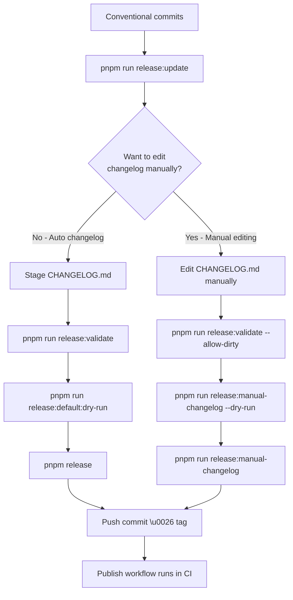
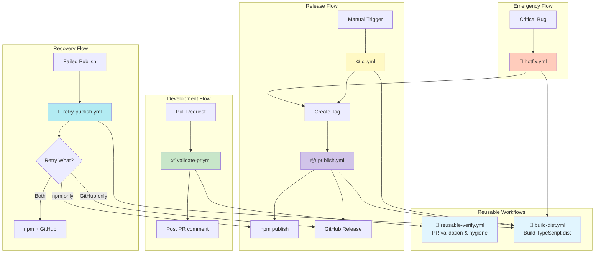

# @oorabona/release-it-preset

Shared [release-it](https://github.com/release-it/release-it) configuration and scripts for automated versioning, changelog generation, and package publishing.

[](https://npmjs.org/package/@oorabona/release-it-preset)
[](https://npmjs.org/package/@oorabona/release-it-preset)
[](https://opensource.org/licenses/MIT)
[](https://nodejs.org/)
[](https://docs.npmjs.com/trusted-publishers)
[](https://github.com/oorabona/release-it-preset/actions/workflows/ci.yml)
[](https://github.com/oorabona/release-it-preset/actions/workflows/audit.yml)
[](https://codecov.io/github/oorabona/release-it-preset)
[](https://www.typescriptlang.org/)

## Why this preset?

Most release workflows fall into one of three traps: too much manual work (plain release-it, you assemble everything), too much ceremony (changesets, great for 5+ maintainers, heavy for one), or too much automation with too little control (semantic-release, hands-off by design and format).

`@oorabona/release-it-preset` occupies the productive middle ground for solo and small-team JavaScript package maintainers who want:

- **Human-readable changelogs.** Keep a Changelog format (Added/Changed/Deprecated/Removed/Fixed/Security) generated automatically from conventional commits — no manual entry writing, no machine-format diffs. `[YANKED]` markers in version headings are preserved transparently; apply them manually post-release per the [Keep a Changelog spec](https://keepachangelog.com/en/1.1.0/).
- **OIDC publishing without CI plumbing.** Import the reusable `publish.yml` workflow in three lines. OIDC trusted publishing with npm provenance ships on day one, no `NPM_TOKEN` secret required.
- **Diagnostic confidence before release.** Run `release-it-preset doctor` to surface every misconfiguration — git auth, npm auth, changelog hygiene, branch requirements — before anything breaks in CI.
- **Recovery presets for the real world.** Dedicated `republish` and `retry-publish` configs handle the scenarios other tools pretend don't happen.

**Pick this preset** if you maintain one or a few npm packages, write Keep a Changelog, deploy from GitHub Actions, and want pre-built OIDC publishing without adopting changesets or semantic-release's philosophy.

**Do not pick this preset** if you have a large monorepo with cross-package dependency management needs (use [changesets](https://github.com/changesets/changesets)) or if you want zero human involvement in versioning decisions (use [semantic-release](https://github.com/semantic-release/semantic-release)).

## Ecosystem positioning

| Tool | Strength | When to prefer it |
|---|---|---|
| **`@oorabona/release-it-preset`** (this) | Keep a Changelog discipline + OIDC workflows + `doctor` CLI + recovery presets | Solo / small-team JS maintainer, human-curated changelogs, GitHub Actions CI |
| [release-it](https://github.com/release-it/release-it) (plain) | Maximum flexibility, smallest opinion footprint | You want to assemble each piece yourself |
| [changesets](https://github.com/changesets/changesets) | PR-driven versioning, fixed/linked package versions | 5+ maintainer monorepo, every change deserves explicit intent |
| [semantic-release](https://github.com/semantic-release/semantic-release) | Fully-automated, zero human intervention | Branch-driven release pipelines, no human review of changelogs |
| [release-please](https://github.com/googleapis/release-please) | GitHub Release PR pattern, 20+ language strategies | Polyglot repos, GitHub-native PR-driven workflow |
| [`@release-it-plugins/workspaces`](https://github.com/release-it-plugins/workspaces) | Multi-package iteration + cross-pkg dep sync | Monorepo with bulk publish — composes with this preset (see [Composing with `@release-it-plugins/workspaces`](#composing-with-release-it-pluginsworkspaces)) |

## Table of Contents

- [Why this preset?](#why-this-preset)
- [Ecosystem positioning](#ecosystem-positioning)
- [Features](#features)
- [Installation](#installation)
  - [Install patterns](#install-patterns)
- [Quick Start](#quick-start)
- [Available Configurations](#available-configurations)
- [CLI Usage](#cli-usage)
  - [Zero-Config Mode (Auto-Detection)](#zero-config-mode-auto-detection)
  - [Preset Selection Mode](#preset-selection-mode)
  - [Passthrough Mode (Custom Config Override)](#passthrough-mode-custom-config-override)
  - [Monorepo Support](#monorepo-support)
  - [Composing with `@release-it-plugins/workspaces`](#composing-with-release-it-pluginsworkspaces)
  - [Utility Commands](#utility-commands)
- [Scripts](#scripts)
- [Environment Variables](#environment-variables)
- [Configuration Modes](#configuration-modes)
- [Borrowing Scripts & Workflows](#borrowing-scripts--workflows)
- [Release Workflow](#release-workflow)
- [GitHub Actions Workflows](#github-actions-workflows)
  - [Reusable Workflows](#reusable-workflows)
  - [Workflow Reference](#workflow-reference)
- [Exit codes](#exit-codes)
- [Best Practices](#best-practices)
- [Troubleshooting](#troubleshooting)
- [Public API](#public-api)
- [Contributing](#contributing)

## Features

- 📦 Multiple release configurations for different scenarios
- 📝 Automatic changelog generation using [Keep a Changelog](https://keepachangelog.com/) format
- 🤖 Conventional commits parsing and categorization
- 🏷️ Git tagging with optional GitHub release automation
- 🚀 npm publishing with provenance (opt-in, ideal for CI)
- 🔄 Republish and retry mechanisms for failed releases
- ⚡ Hotfix release support
- 🎯 Environment variable configuration
- 🔍 Zero-config auto-detection mode
- 🏢 Monorepo support with parent directory config references
- ⚙️ Passthrough mode for custom config files

## Installation

```bash
pnpm add -D @oorabona/release-it-preset release-it
```

### Install patterns

| Use case | Command | Notes |
|---|---|---|
| **Try without installing** | `pnpm dlx @oorabona/release-it-preset doctor` | Fetch + run, no install. Use for evaluating the preset on an existing repo. |
| **One-shot npx** | `npx -y @oorabona/release-it-preset doctor` | Same idea, npm-flavored |
| **Adopt as devDep** (recommended) | `pnpm add -D @oorabona/release-it-preset release-it` | Pins via lockfile, idiomatic for projects |
| **CI usage** | `pnpm install --frozen-lockfile && pnpm exec release-it-preset retry-publish --ci` | Lockfile-deterministic, no prompts |
| **Diagnostic on any repo** | `pnpm dlx @oorabona/release-it-preset doctor` | Works against the cwd's git/package.json/CHANGELOG; great for quick health checks |

**Global install is not recommended** — pin per-project for reproducibility. The preset is small (<20KB unpacked); CI overhead is negligible.

The peer requirement is `release-it ^19.0.0 || ^20.0.0`. CI runs against the upper bound (v20.x) on every commit; v19 was smoke-tested manually before the constraint was widened. v20 is recommended for the OIDC trusted publishing handshake (npm ≥ 11.5.1, Node ≥ 24); v19 is supported for composing with [`@release-it-plugins/workspaces`](#composing-with-release-it-pluginsworkspaces) (its peer maxes at v19 today).

## Quick Start

### Option 1: Using the CLI (Recommended)

Add scripts to your `package.json`:

```json
{
  "scripts": {
    "release": "release-it-preset default",
    "release:hotfix": "release-it-preset hotfix"
  }
}
```

Then run:

```bash
pnpm release
```

### Option 2: Using extends

Create `.release-it.json` in your project:

```json
{
  "extends": "@oorabona/release-it-preset/config/default"
}
```

Add scripts to your `package.json`:

```json
{
  "scripts": {
    "release": "release-it"
  }
}
```

### Initialize CHANGELOG.md

Create a `CHANGELOG.md` file with Keep a Changelog format:

```markdown
# Changelog

All notable changes to this project will be documented in this file.

The format is based on [Keep a Changelog](https://keepachangelog.com/en/1.1.0/),
and this project adheres to [Semantic Versioning](https://semver.org/spec/v2.0.0.html).

## [Unreleased]

### Added
- Initial release
```

## GitHub Actions

### Quick Start: Reusable Workflows

Import pre-configured workflows into your repository:

**PR Validation:**
```yaml
name: PR Checks

on:
  pull_request:
    types: [opened, synchronize, reopened]

permissions:
  contents: read
  pull-requests: write

jobs:
  validate:
    uses: oorabona/release-it-preset/.github/workflows/reusable-verify.yml@main
    with:
      base-ref: origin/${{ github.base_ref }}
      head-ref: ${{ github.sha }}
      run-tests: true
    secrets: inherit
```

**Publish on Tag:**
```yaml
name: Publish

on:
  push:
    tags: ['v*']

permissions:
  contents: write
  id-token: write

jobs:
  publish:
    uses: oorabona/release-it-preset/.github/workflows/publish.yml@main
    secrets:
      NPM_TOKEN: ${{ secrets.NPM_TOKEN }}
```

📖 **[Full Reusable Workflows Documentation](examples/reusable-workflows.md)** | 📚 **[CI/CD Integration Examples](examples/ci-integration.md)**

## Available Configurations

### `default` - Standard Release

Full-featured release with changelog, git operations, and optional GitHub/npm publishing.

**CLI:**
```bash
pnpm release-it-preset default
```

**Extends:**
```json
{
  "extends": "@oorabona/release-it-preset/config/default"
}
```

Features:
- ✅ Version bumping (interactive)
- ✅ Automatic changelog population from conventional commits
- ✅ Git commit, tag, and push
- ☑️ GitHub release creation (set `GITHUB_RELEASE=true`)
- ☑️ npm publishing with provenance (set `NPM_PUBLISH=true`)

### `hotfix` - Emergency Hotfix

For urgent patches that need quick changelog generation from git log (GitHub/npm remain opt-in).

**CLI:**
```bash
pnpm release-it-preset hotfix
```

**Extends:**
```json
{
  "extends": "@oorabona/release-it-preset/config/hotfix"
}
```

Features:
- ✅ Forced patch version increment
- ✅ Automatic changelog from recent commits
- ✅ Pre-bump unreleased section population
- ☑️ GitHub release with extracted notes (set `GITHUB_RELEASE=true`)
- ☑️ npm publishing with provenance (set `NPM_PUBLISH=true`)

### `changelog-only` - Changelog Preparation

Updates changelog without performing a release (useful in CI or pre-release).

**CLI:**
```bash
pnpm release-it-preset changelog-only --ci
```

**Extends:**
```json
{
  "extends": "@oorabona/release-it-preset/config/changelog-only"
}
```

Features:
- ✅ Populates [Unreleased] section
- ❌ No version bump
- ❌ No git operations
- ❌ No publishing

### `manual-changelog` - Manual Changelog Release

For releases where you've manually edited the [Unreleased] section in CHANGELOG.md.
Skips automatic changelog generation while keeping GitHub/npm steps opt-in.

**Workflow:**
```bash
# 1. Generate initial changelog
pnpm release-it-preset update

# 2. Manually edit CHANGELOG.md [Unreleased] section

# 3. Release without regenerating changelog
pnpm release-it-preset manual-changelog
```

**Extends:**
```json
{
  "extends": "@oorabona/release-it-preset/config/manual-changelog"
}
```

Features:
- ✅ Version bumping (interactive)
- ✅ Preserves manual [Unreleased] edits
- ✅ Moves [Unreleased] to versioned section
- ✅ Git commit, tag, and push
- ☑️ GitHub release creation (set `GITHUB_RELEASE=true`)
- ☑️ npm publishing with provenance (set `NPM_PUBLISH=true`)
- ❌ Skips automatic changelog population

### `no-changelog` - Quick Release

Standard release without changelog updates; GitHub/npm steps remain opt-in.

**CLI:**
```bash
pnpm release-it-preset no-changelog
```

**Extends:**
```json
{
  "extends": "@oorabona/release-it-preset/config/no-changelog"
}
```

Features:
- ✅ Version bumping
- ✅ Git operations
- ☑️ GitHub releases (set `GITHUB_RELEASE=true`)
- ☑️ npm publishing (set `NPM_PUBLISH=true`)
- ❌ No changelog updates

### `republish` - Git Tag Move + GitHub Release Update

⚠️ **DANGER**: Moves an existing git tag to HEAD and updates the GitHub release notes (breaks semver immutability for that tag).

Only use when you need to fix a broken release that requires moving the git tag. This preset **does not publish to npm** — npm immutability (since 2016) makes republishing an existing version impossible under any dist-tag. See [ADR 0005](docs/adr/0005-republish-scope-narrowing.md).

Alternatives:
- **dist-tag change** (e.g. move `latest` to a different version): `npm dist-tag add @oorabona/release-it-preset@<version> latest`
- **Retry a failed npm/GitHub publish**: use the `retry-publish` preset instead

**CLI:**
```bash
pnpm release-it-preset republish
```

**Extends:**
```json
{
  "extends": "@oorabona/release-it-preset/config/republish"
}
```

Features:
- ⚠️ Moves existing git tag
- ✅ Updates changelog for current version
- ☑️ Updates GitHub release (set `GITHUB_RELEASE=true`)
- ❌ Does not publish to npm (npm immutability — use `npm dist-tag add` or `retry-publish`)

### `retry-publish` - Retry Failed Publishing

Retries npm/GitHub publishing for an existing tag without modifying git history; opt in to each surface via `NPM_PUBLISH` and `GITHUB_RELEASE`.

**CLI:**
```bash
# Step 1: Run pre-flight checks (optional)
pnpm release-it-preset retry-publish-preflight
# Advanced (direct compiled call)
# node node_modules/@oorabona/release-it-preset/dist/scripts/retry-publish.js

# Step 2: Retry the publish
pnpm release-it-preset retry-publish
```

**Extends:**
```json
{
  "extends": "@oorabona/release-it-preset/config/retry-publish"
}
```

Features:
- ☑️ Republishes to npm (set `NPM_PUBLISH=true`)
- ☑️ Updates GitHub release (set `GITHUB_RELEASE=true`)
- ❌ No version increment
- ❌ No git operations

## CLI Usage

The package provides a `release-it-preset` CLI with four operating modes:

1. **Zero-Config Mode** (auto-detection) - No arguments needed
2. **Preset Selection Mode** - Specify which preset to use
3. **Passthrough Mode** - Direct config file override
4. **Utility Mode** - Helper commands

### Zero-Config Mode (Auto-Detection)

The CLI can automatically detect which preset to use from your `.release-it.json`:

```bash
# Just run release-it-preset with no arguments
pnpm release-it-preset

# 🔍 Auto-detected preset: default
# ✅ Config validated: preset "default"
# 📝 Using: /path/to/.release-it.json
```

**How it works:**
1. CLI reads your `.release-it.json`
2. Extracts the preset name from the `extends` field
3. Runs that preset automatically

**Requirements:**
- `.release-it.json` must exist
- Must have `extends` field like `"@oorabona/release-it-preset/config/default"`

**Benefits:**
- ✅ Shortest command possible
- ✅ Config file is source of truth
- ✅ No need to remember preset names
- ✅ Follows industry standards (ESLint, TypeScript, Prettier)

### Preset Selection Mode

Run release-it with specific configurations:

```bash
# Show help
pnpm release-it-preset --help

# Run releases
pnpm release-it-preset default --dry-run
pnpm release-it-preset hotfix --verbose
pnpm release-it-preset changelog-only --ci
pnpm release-it-preset manual-changelog
```

All additional arguments are passed through to release-it.

### Passthrough Mode (Custom Config Override)

Use a custom config file and bypass preset validation:

```bash
# Use custom config file
pnpm release-it-preset --config .release-it-manual.json

# 🔀 Passthrough mode: using config .release-it-manual.json
#    Bypassing preset validation - direct release-it invocation
```

**Use cases:**
- **Switching presets occasionally** - Have multiple config files for different scenarios
- **Monorepo workflows** - Reference shared configs from parent directories
- **Advanced customization** - Full control over release-it configuration

**Example workflow:**

```json
// .release-it.json (default - 95% of time)
{
  "extends": "@oorabona/release-it-preset/config/default",
  "git": { "requireBranch": "develop" }
}

// .release-it-manual.json (rare - 5% of time)
{
  "extends": "@oorabona/release-it-preset/config/manual-changelog",
  "git": { "requireBranch": "develop" }
}
```

```bash
# Normal release
pnpm release-it-preset                              # Auto-detects default

# Manual changelog release (rare)
pnpm release-it-preset --config .release-it-manual.json
```

**Benefits:**
- ✅ No need to edit `.release-it.json` to switch presets
- ✅ Config files are explicit and version-controlled
- ✅ Works with monorepo parent directory references

### Monorepo Support

Parent directory config references are now supported:

```bash
# Monorepo structure
/my-monorepo/
├── .release-it-base.json        # Shared configuration
├── packages/
│   ├── core/
│   │   └── .release-it.json     # extends: ../../.release-it-base.json
│   └── utils/
│       └── .release-it.json     # extends: ../../.release-it-base.json
```

```json
// packages/core/.release-it.json
{
  "extends": [
    "../../.release-it-base.json",                    // ✅ Parent reference allowed!
    "@oorabona/release-it-preset/config/default"
  ]
}
```

**Security validation:**
- ✅ Parent directory references (`../`) supported (up to 5 levels)
- ✅ Config file extension whitelist (`.json`, `.js`, `.cjs`, `.mjs`, `.yaml`, `.yml`, `.toml`)
- ✅ File existence validation
- ❌ Absolute paths blocked (use relative paths)
- ❌ Excessive traversal blocked (max `../../../../../../`)

**Why this is safe:**
- Config files are trusted code (developer controls the repository)
- Industry standard pattern (TypeScript, ESLint, Prettier all allow `../`)
- Multiple validation layers prevent abuse
- No privilege escalation in CLI tool context

See [examples/monorepo-workflow.md](examples/monorepo-workflow.md) for complete monorepo guide and [examples/monorepo/](examples/monorepo/) for a runnable workspace demo.

### Composing with `@release-it-plugins/workspaces`

This preset focuses on a single package per release-it run. If your monorepo needs **bulk publish** (iterate over every workspace package + sync cross-package dependency versions), compose this preset with [`@release-it-plugins/workspaces`](https://github.com/release-it-plugins/workspaces) — the canonical release-it plugin for that workflow.

```bash
# Install both
pnpm add -D @oorabona/release-it-preset @release-it-plugins/workspaces release-it@^19
```

```jsonc
// .release-it.json — extends our preset AND loads the workspaces plugin
{
  "extends": "@oorabona/release-it-preset/config/default",
  "plugins": {
    "@release-it-plugins/workspaces": true
  }
}
```

**Peer compatibility note:** `@release-it-plugins/workspaces` v5.0.3 declares peer `release-it ^17 || ^18 || ^19`. Our preset declares peer `^19 || ^20`. The intersection is `^19`, so when composing with the workspaces plugin you must pin release-it to v19. v20 standalone (without the workspaces plugin) is fully supported and recommended for new projects.

`release-it-preset doctor` does **not** check whether the workspaces plugin is loaded — it's an opt-in composition. Run it manually after install if you want to verify the plugin's own preflight checks.

When this composition is right for you:
- You release multiple packages from one repo with **synchronized versions** (all bumped together).
- You want **cross-package dependency sync** (when `pkg-a` bumps to 2.0, `pkg-b`'s reference auto-updates).

When our preset alone is enough:
- **Independent versioning** per package (each package releases when ready). Use `GIT_CHANGELOG_PATH=packages/<pkg>` to scope the CHANGELOG. See [examples/monorepo/](examples/monorepo/) for the runnable demo.

### Utility Commands

Helper commands for project setup and maintenance:

#### `init` - Initialize Project

Creates CHANGELOG.md, .release-it.json, and optionally adds scripts to package.json:

```bash
# Interactive mode (asks for confirmation)
pnpm release-it-preset init

# Non-interactive mode (skip prompts, use defaults)
pnpm release-it-preset init --yes
```

**What it does:**
- Creates `CHANGELOG.md` with Keep a Changelog template
- Creates `.release-it.json` with extends configuration
- Optionally adds release scripts to `package.json`
- Skips existing files in `--yes` mode

> One-off usage: `pnpm dlx @oorabona/release-it-preset init` (or `npx @oorabona/release-it-preset init`) runs the CLI without installing it as a dependency.

#### `update` - Update Changelog

Updates the [Unreleased] section with commits since last tag:

```bash
pnpm release-it-preset update
```

**What it does:**
- Parses conventional commits since last git tag
- Groups commits by type (Added, Fixed, Changed, etc.)
- Updates [Unreleased] section in CHANGELOG.md
- Generates commit links to repository
- Uses only the conventional commit subject; feel free to edit `CHANGELOG.md` afterwards if you want to add the detailed bullet points that lived in the commit body

#### `validate` - Validate Release Readiness

Checks if project is ready for release:

```bash
# Standard validation
pnpm release-it-preset validate

# Allow uncommitted changes
pnpm release-it-preset validate --allow-dirty
```

**What it checks:**
- ✅ CHANGELOG.md exists and is well-formatted
- ✅ [Unreleased] section has content
- ✅ Working directory is clean (unless --allow-dirty)
- ✅ npm authentication works (npm whoami)
- ✅ Current branch is allowed (if GIT_REQUIRE_BRANCH is set)

Exit code 0 if all checks pass, 1 if any fail (useful in CI/pre-commit hooks).

#### `check` - Diagnostic Information

Displays configuration and project status:

```bash
pnpm release-it-preset check
```

**What it shows:**
- Environment variables and their values
- Repository information (URL, branch, remote)
- Git tags and latest version
- Commits since last tag
- Configuration files status
- npm authentication status

Useful for debugging release issues.

#### `doctor` - Release Readiness Diagnostic

Runs a structured checklist across four categories and outputs a readiness score:

```bash
pnpm release-it-preset doctor
pnpm release-it-preset doctor --json
```

**What it checks:**

| Category | Checks |
|----------|--------|
| Environment | Known env vars, source (env / default / unset), publish-mode consistency |
| Repository | Git repo presence, branch vs `GIT_REQUIRE_BRANCH`, latest tag, commit count, dirty WD, upstream tracking, remote URL |
| Configuration | `CHANGELOG.md` exists + Keep a Changelog format + `[Unreleased]` content, `.release-it.json` parseable + `extends` field, `package.json` valid semver version |
| Readiness Summary | `PASS`/`WARN`/`FAIL` counts, score `N/M checks passing`, status (`READY`/`WARNINGS`/`BLOCKED`), actionable recommendations |

**Exit codes:**
- `0` — status is `READY` or `WARNINGS`
- `1` — status is `BLOCKED` (at least one `FAIL`)

**`--json` output shape:**
```json
{
  "environment": { "checks": [...], "vars": [...], "status": "PASS" },
  "repository":  { "checks": [...], "status": "WARN" },
  "configuration": { "checks": [...], "status": "PASS" },
  "summary": {
    "pass": 10, "warn": 2, "fail": 0, "total": 12,
    "score": "10/12 checks passing",
    "status": "WARNINGS",
    "recommendations": ["Review 2 warning(s) before releasing"]
  }
}
```

Use `doctor` as a pre-release sanity check, and `check` for the full verbose configuration dump.

#### `check-pr` - Pull Request Hygiene

Evaluates PR readiness by analysing commits and changelog changes. Designed for CI usage but safe locally when the required environment variables are set (`PR_BASE_REF`, `PR_HEAD_REF`).

```bash
PR_BASE_REF=origin/main PR_HEAD_REF=HEAD pnpm release-it-preset check-pr
```

Outputs JSON summaries for workflows (base64 encoded) and prints a human-readable report.

#### `retry-publish-preflight` - Retry Safety Checks

Runs the retry publish pre-flight script with the same CLI convenience wrapper as other utilities. Verifies that the latest tag exists, matches `package.json`, and that there are no unexpected workspace changes before attempting a retry.

```bash
pnpm release-it-preset retry-publish-preflight
```

Use this before calling `pnpm release-it-preset retry-publish` when recovering from a failed publish.

### pnpm Script Shortcuts

The root `package.json` defines helper scripts that wrap the CLI so you can run the most common flows with `pnpm run`:

- `pnpm release` → run the default release config (`release-it-preset default`)
- `pnpm run release:default:dry-run` → dry-run the default release configuration
- `pnpm run release:no-changelog` → publish without touching the changelog
- `pnpm run release:changelog-only` → update only the changelog
- `pnpm run release:manual-changelog` → release with manually edited changelog (skip auto-generation)
- `pnpm run release:hotfix` → execute the hotfix workflow
- `pnpm run release:republish` → trigger the republish workflow (dangerous flow)
- `pnpm run release:retry-preflight` → run retry publish safety checks
- `pnpm run release:retry-publish` → retry npm/GitHub publishing for an existing tag
- `pnpm run release:update` → populate the `[Unreleased]` section
- `pnpm run release:validate` → run release validation checks
- `pnpm run release:validate:allow-dirty` → validation that tolerates uncommitted changes
- `pnpm run release:check` → show diagnostic information about the current repo

## Scripts

Scripts are authored in TypeScript but distributed as compiled ESM JavaScript in `dist/scripts`. Under normal circumstances you should invoke them via the `release-it-preset` CLI or the pnpm aliases listed above; the CLI automatically prefers the compiled build and falls back to `tsx` only for local development. The direct `node` examples below are provided for automation scenarios where you deliberately want to call the compiled output.

### `extract-changelog.ts`

Extracts the changelog entry for a specific version (used automatically by the release notes generator). If you ever need to call it manually:

```bash
node node_modules/@oorabona/release-it-preset/dist/scripts/extract-changelog.js 1.2.3
```

### `populate-unreleased-changelog.ts`

Populates the [Unreleased] section with commits since the last tag using conventional commits.

```bash
# Preferred
pnpm release-it-preset update
# or
pnpm run release:update

# Advanced (call compiled output directly)
node node_modules/@oorabona/release-it-preset/dist/scripts/populate-unreleased-changelog.js
```

Supported commit types:
- `feat`, `feature`, `add` → Added
- `fix`, `bugfix` → Fixed
- `deprecate`, `deprecated`, `deprecation` → Deprecated
- `perf`, `refactor`, `style`, `docs`, `test`, `chore`, `build` → Changed
- `remove`, `removed`, `delete`, `deleted` → Removed
- `security` → Security
- `ci`, `release`, `hotfix` → Ignored

Add `[skip-changelog]` to commit message to exclude it.

### `republish-changelog.ts`

Moves [Unreleased] content to the current version entry (for republishing).

```bash
# Preferred
pnpm run release:republish
# or
pnpm release-it-preset republish

# Advanced
node node_modules/@oorabona/release-it-preset/dist/scripts/republish-changelog.js
```

### `retry-publish.ts`

Performs pre-flight checks before retrying a failed publish.

```bash
# Preferred (CLI)
pnpm release-it-preset retry-publish-preflight

# Advanced (call compiled output directly)
node node_modules/@oorabona/release-it-preset/dist/scripts/retry-publish.js
```

## Environment Variables

Customize behavior with environment variables:

### Changelog
- `CHANGELOG_FILE` - Changelog file path (default: `CHANGELOG.md`)
- `GIT_CHANGELOG_PATH` - Optional. When set to a repository-relative path (e.g. `packages/tar-xz`), restrict changelog generation to commits touching that path. Useful for monorepo per-package CHANGELOG files. Empty / unset = repository-wide (default).
- `GIT_CHANGELOG_SINCE` - Optional. Override the `since` baseline for changelog generation (any git ref: SHA, tag, branch). When set, bypasses both the per-package release-commit detection and the `git describe --tags` fallback. Useful for monorepo workspaces with non-standard release commit patterns. Empty / unset = use auto-detection.
- `CHANGELOG_TYPE_MAP` - Optional. JSON string mapping commit types to CHANGELOG section headings. Merged on top of `.changelog-types.json` (if present) and the built-in defaults. Use `false` as a value to suppress a type entirely. Example: `CHANGELOG_TYPE_MAP='{"ops":"### Operations","deps":"### Dependencies"}'`.

### Custom type map (`.changelog-types.json`)

Create a `.changelog-types.json` file in your project root to override or extend the built-in commit-type → section mapping at the project level. The file is merged on top of the built-in defaults; individual keys can be overridden without touching the rest.

**Resolution order** (highest priority wins):
1. `CHANGELOG_TYPE_MAP` env var (runtime override, e.g. in CI)
2. `.changelog-types.json` project file
3. Built-in defaults

**Example `.changelog-types.json`:**
```json
{
  "deps": "### Dependencies",
  "ops": "### Operations",
  "ci": false
}
```
- String values must be a valid `### Section Heading`.
- `false` suppresses the type (no CHANGELOG entry emitted).
- Malformed JSON or invalid values → warning logged, layer ignored, lower-priority map used.

**BREAKING CHANGE: footer parsing** (Conventional Commits 1.0.0 §6): `BREAKING CHANGE:` is recognised as a footer only when it appears after a blank-line separator from the preceding paragraph. Mid-body occurrences without the blank line do not promote the commit to breaking. Multiple `BREAKING CHANGE:` lines in the same footer paragraph each emit a separate entry under `### ⚠️ BREAKING CHANGES`.

### Git
- `GIT_COMMIT_MESSAGE` - Commit message template. Defaults vary per preset: `chore(release): v${version}` (`default`), `chore(hotfix): v${version}` (`hotfix`), `chore: republish v${version}` (`republish`). Set this env var to override across all presets.
- `GIT_TAG_NAME` - Tag name template (default: `v${version}`)
- `GIT_REQUIRE_BRANCH` - Required branch (default: `main`)
- `GIT_REQUIRE_UPSTREAM` - Require upstream tracking (default: `false`)
- `GIT_REQUIRE_CLEAN` - Require clean working directory (default: `false`)
- `GIT_REMOTE` - Git remote name (default: `origin`)
- `GIT_CHANGELOG_COMMAND` - Override the git log command used for previews (default filters out release/hotfix/ci commits)
- `GIT_CHANGELOG_DESCRIBE_COMMAND` - Override the latest-tag detection command (default: `git describe --tags --abbrev=0`)

### GitHub
- `GITHUB_RELEASE` - Enable GitHub releases (default: `false`)
- `GITHUB_REPOSITORY` - Repository in `owner/repo` format (auto-detected from git remote)

### npm
- `NPM_PUBLISH` - Enable npm publishing (default: `false`)
- `NPM_SKIP_CHECKS` - Skip npm checks (default: `false`)
- `NPM_ACCESS` - npm access level (default: `public`)
- `NPM_TAG` - Optional. When set, the npm publish step appends `--tag <value>` (e.g. `legacy-v0.10.0`). Used to assign version-named dist-tags when republishing older versions so `latest` is not overwritten. Empty / unset = npm uses `latest`.

### Hotfix
- `HOTFIX_INCREMENT` - Increment kind passed to release-it for the `hotfix` preset (default: `patch`). Accepts any release-it increment value (`patch`, `minor`, `major`, or an explicit version).

> ℹ️  By default, the presets skip GitHub releases and npm publishing. Set `GITHUB_RELEASE=true` and/or `NPM_PUBLISH=true` in the environment (typically in CI) when you are ready to perform those steps.

### Example

```bash
CHANGELOG_FILE="HISTORY.md" \
GIT_REQUIRE_BRANCH="develop" \
GIT_REQUIRE_CLEAN="true" \
pnpm release
```

## Configuration Modes

The preset supports two configuration modes:

### Mode 1: Direct Preset Usage (No Config File)

**When to use:** Simple projects, trust preset defaults, or customize only via environment variables

Don't create `.release-it.json`. Just run the CLI:

```bash
pnpm release-it-preset default
```

All configuration comes from the preset and environment variables.

**Pros:**
- ✅ Zero config files
- ✅ Consistent behavior across projects
- ✅ Easy to understand
- ✅ Perfect for getting started

---

### Mode 2: Preset + User Overrides (Recommended)

**When to use:** Customize specific options while keeping preset defaults

Create `.release-it.json` **WITH the `extends` field**:

```json
{
  "extends": "@oorabona/release-it-preset/config/default",
  "git": {
    "requireBranch": "master",
    "commitMessage": "chore: release v${version}"
  }
}
```

Run with CLI preset:

```bash
pnpm release-it-preset default
```

**How it works:**
- The `extends` field loads the preset
- release-it merges your overrides on top via c12
- **Your values take precedence** over preset defaults
- CLI validates that `extends` matches the command

**Pros:**
- ✅ **Recommended for customization**
- ✅ Declarative config with explicit preset
- ✅ Industry standard pattern (like ESLint, TypeScript)
- ✅ Guaranteed config merging via release-it's c12

**Example:** Using `hotfix` preset but release from `master` instead of `main`:

```json
{
  "extends": "@oorabona/release-it-preset/config/hotfix",
  "git": {
    "requireBranch": "master"
  }
}
```

```bash
pnpm release-it-preset hotfix
```

---

### Configuration Validation

The CLI validates your `.release-it.json` to prevent misconfigurations:

#### Error 1: Missing `extends` field

```bash
# .release-it.json without extends:
{
  "git": { "requireBranch": "master" }
}

# Running:
pnpm release-it-preset default

# ❌ Configuration error!
#    .release-it.json is missing the required "extends" field.
#
#    Without "extends", your config won't merge with the preset.
#    This means you'll get release-it defaults instead of preset defaults.
#
#    Fix by adding this to .release-it.json:
#      {
#        "extends": "@oorabona/release-it-preset/config/default",
#        ...your overrides
#      }
```

**Why `extends` is required:** Without it, release-it only loads your config file and uses release-it's own defaults. The preset is never loaded, so you lose important defaults like `npm.publish: false`.

#### Error 2: Preset mismatch

```bash
# .release-it.json extends "default":
{
  "extends": "@oorabona/release-it-preset/config/default"
}

# But you run:
pnpm release-it-preset hotfix

# ❌ Configuration mismatch error!
#    CLI preset:               hotfix
#    .release-it.json extends: default
#
#    Either:
#      1. Run: release-it-preset default
#      2. Update .release-it.json extends to: "@oorabona/release-it-preset/config/hotfix"
```

---

### Which Mode Should I Use?

| Scenario | Recommended Mode |
|----------|------------------|
| Quick start, minimal config | **Mode 1** (No config file) |
| Customize branch/commit/hooks | **Mode 2** (Config with extends) |
| Environment-only customization | **Mode 1** (Use env vars) |
| Monorepo with per-package config | **Mode 2** (Each package has own config) |

**Use Mode 1 to get started, switch to Mode 2 when you need customization.**

## Borrowing Scripts & Workflows

- The root `package.json` of this repository shows how to expose convenient `pnpm run release:*` shortcuts. Feel free to copy that block into your own project (adjust the commands if you only need a subset).
- The GitHub Actions workflows under `.github/workflows/*.yml` illustrate how to wire the CLI into CI. They are safe to reuse, provided you review the permissions/secrets section and adapt branch names or triggers to your process.

## Release Workflow

### Recommended Workflow

**Local (Developer):**
1. Make changes and commit with conventional commits
2. Run `pnpm run release:update` to populate the `[Unreleased]` section from commits
3. Review `CHANGELOG.md` - you have two options here:

   **Option A: Quick release with auto-generated changelog**
   - Stage `CHANGELOG.md` as-is
   - Run `pnpm run release:validate` to verify readiness
   - Dry-run with `pnpm run release:default:dry-run`
   - Execute `pnpm release` to perform the real release

   **Option B: Manual changelog editing (recommended for detailed release notes)**
   - Manually edit `CHANGELOG.md` [Unreleased] section (add narrative, reorganize, etc.)
   - No need to stage or commit
   - Run `pnpm run release:validate` (or `pnpm run release:validate:allow-dirty`)
   - Dry-run with `pnpm run release:manual-changelog --dry-run`
   - Execute `pnpm run release:manual-changelog` to release
     - This skips changelog regeneration, preserving your edits
     - Bumps version, moves [Unreleased] to versioned section
    - Creates release commit + tag and pushes to origin (GitHub release happens later if `GITHUB_RELEASE=true` in CI)

   **If you change your mind mid-release:** If you started with Option A but want to add manual edits when prompted `Commit (chore(release): vX.Y.Z)?`, answer **No**, then press Ctrl+C to abort. Edit your `CHANGELOG.md`, then run `pnpm run release:manual-changelog` instead. Alternatively, re-run `pnpm release` and select the same version again (the preset's `--allow-same-version` makes this safe).

4. **Note:** GitHub releases and npm publish are skipped locally by default. Enable them with environment variables or let the `publish.yml` workflow handle both steps after the tag push.


```mermaid
flowchart TD
  A[Conventional commits] --> B[pnpm run release:update]
  B --> C{Want to edit<br/>changelog manually?}

  C -->|No - Auto changelog| D[Stage CHANGELOG.md]
  D --> E[pnpm run release:validate]
  E --> F[pnpm run release:default:dry-run]
  F --> G[pnpm release]

  C -->|Yes - Manual editing| H[Edit CHANGELOG.md manually]
  H --> I[pnpm run release:validate --allow-dirty]
  I --> J[pnpm run release:manual-changelog --dry-run]
  J --> K[pnpm run release:manual-changelog]

  G --> L[Push commit \u0026 tag]
  K --> L
  L --> M[Publish workflow runs in CI]
```

**CI (GitHub Actions):**
- When tag is pushed, CI publishes to npm with provenance

### Why This Workflow?

- **Single CI entry point** - Tag pushes run the `retry-publish` preset, which updates the GitHub release and publishes to npm with provenance in one command.
- **Local runs stay safe** - Without `GITHUB_RELEASE=true` or `NPM_PUBLISH=true`, the presets only handle changelog updates, commits, and tags.
- **Better security** - Publishing requires CI credentials (GITHUB_TOKEN + NPM_TOKEN), keeping local environments token-free by default.
- **Predictable outputs** - Release notes are regenerated from the committed changelog, avoiding drift between local runs and CI.

### GitHub Actions Setup

Create `.github/workflows/publish.yml`:

```yaml
name: Publish Package

on:
  push:
    tags:
      - 'v*'

permissions:
  contents: write
  id-token: write  # For npm provenance

jobs:
  publish:
    runs-on: ubuntu-latest
    steps:
      - uses: actions/checkout@v4

      - uses: pnpm/action-setup@v4

      - uses: actions/setup-node@v4
        with:
          node-version: 20
          registry-url: 'https://registry.npmjs.org'
          cache: 'pnpm'

      - run: pnpm install --frozen-lockfile

      - run: pnpm build

      - name: Update GitHub release and publish to npm
        run: pnpm release-it-preset retry-publish --ci
        env:
          NPM_TOKEN: ${{ secrets.NPM_TOKEN }}
          NPM_PUBLISH: 'true'
          GITHUB_RELEASE: 'true'
          GITHUB_TOKEN: ${{ secrets.GITHUB_TOKEN }}
```

**Required Secrets:**
- `NPM_TOKEN` - Automation token from npmjs.com (Settings → Access Tokens → Generate New Token → Automation)
- `GITHUB_TOKEN` is provided automatically by GitHub Actions (no manual secret needed)

**Required Permissions (locally):**
- Set `GITHUB_RELEASE=true` and/or `NPM_PUBLISH=true` only when you explicitly want to perform those actions from your machine. Provide `GITHUB_TOKEN`/`NPM_TOKEN` as needed.

### Alternative: Full CI Release

If you prefer to run the entire release in CI:

```yaml
on:
  workflow_dispatch:  # Manual trigger
    inputs:
      version:
        description: 'Version bump type'
        required: true
        type: choice
        options: [patch, minor, major]

permissions:
  contents: write  # For git operations and GitHub releases
  id-token: write  # For npm provenance

jobs:
  release:
    runs-on: ubuntu-latest
    steps:
      # ... setup steps ...

      - run: pnpm release-it-preset default --ci --increment ${{ inputs.version }}
        env:
          GITHUB_TOKEN: ${{ secrets.GITHUB_TOKEN }}
          NPM_TOKEN: ${{ secrets.NPM_TOKEN }}
          GITHUB_RELEASE: 'true'
          NPM_PUBLISH: 'true'
```

## GitHub Actions Workflows

This repository includes several GitHub Actions workflows for automated CI/CD and release management.

### Reusable Workflows

Two workflows are designed for reuse in your own projects:

#### 🔄 `reusable-verify.yml` - PR Validation & Hygiene Checks

Validates TypeScript compilation, runs tests, checks release readiness, and evaluates PR hygiene (changelog updates, conventional commits).

**When to use:** Import this workflow in your PR validation to ensure code quality and release readiness.

**Inputs:**

| Input | Type | Default | Description |
|-------|------|---------|-------------|
| `node-version` | string | `'20'` | Node.js version to use |
| `run-tests` | boolean | `false` | Run `pnpm test` after compilation |
| `base-ref` | string | `''` | Base ref for diff comparisons (e.g., `origin/main`) |
| `head-ref` | string | `'HEAD'` | Head ref for comparisons |
| `install-args` | string | `'--frozen-lockfile'` | Additional pnpm install arguments |
| `fetch-depth` | number | `0` | Git fetch depth for checkout |

**Outputs:**

| Output | Description |
|--------|-------------|
| `release_validation` | `'true'` when release validation passes |
| `changelog_status` | Changelog status: `updated`, `skipped`, or `missing` |
| `skip_changelog` | `'true'` when `[skip-changelog]` detected in commits |
| `conventional_commits` | `'true'` when conventional commits detected |
| `commit_messages` | Base64 encoded JSON array of analyzed commit messages |
| `changed_files` | Base64 encoded JSON array of changed files |

**Example usage in your project:**

```yaml
# .github/workflows/validate-pr.yml
name: PR Validation

on:
  pull_request:
    types: [opened, synchronize, reopened]

jobs:
  validate:
    uses: oorabona/release-it-preset/.github/workflows/reusable-verify.yml@main
    with:
      node-version: '20'
      base-ref: origin/${{ github.base_ref }}
      head-ref: ${{ github.sha }}
      run-tests: true
    secrets: inherit

  comment:
    needs: validate
    runs-on: ubuntu-latest
    if: always()
    permissions:
      pull-requests: write
    steps:
      - uses: actions/github-script@v7
        with:
          script: |
            const summary = `## 📋 PR Validation

            ${needs.validate.outputs.release_validation === 'true' ? '✅' : '⚠️'} Release validation
            ${needs.validate.outputs.changelog_status === 'updated' ? '✅' : 'ℹ️'} Changelog: ${needs.validate.outputs.changelog_status}
            ${needs.validate.outputs.conventional_commits === 'true' ? '✅' : 'ℹ️'} Conventional commits
            `;

            github.rest.issues.createComment({
              owner: context.repo.owner,
              repo: context.repo.repo,
              issue_number: context.issue.number,
              body: summary
            });
```

#### 🔄 `build-dist.yml` - Build Compiled Distribution

Builds TypeScript sources to `dist/` and uploads as artifact for reuse in other jobs.

**When to use:** When you need compiled outputs across multiple jobs without rebuilding.

**Inputs:**

| Input | Type | Default | Description |
|-------|------|---------|-------------|
| `artifact_name` | string | `'dist-build'` | Name for the uploaded dist artifact |
| `ref` | string | (current) | Optional git ref to checkout before building |

**Outputs:**

| Output | Description |
|--------|-------------|
| `artifact_name` | Name of the uploaded dist artifact |

**Example usage in your project:**

```yaml
# .github/workflows/ci.yml
jobs:
  build:
    uses: oorabona/release-it-preset/.github/workflows/build-dist.yml@main
    with:
      artifact_name: my-dist
      ref: ${{ github.sha }}

  test:
    needs: build
    runs-on: ubuntu-latest
    steps:
      - uses: actions/checkout@v4
      - uses: actions/download-artifact@v4
        with:
          name: ${{ needs.build.outputs.artifact_name }}
          path: dist
      - run: pnpm test
```

### Workflow Reference

#### Overview Table

| Workflow | Type | Trigger | Purpose |
|----------|------|---------|---------|
| 🔄 [reusable-verify.yml](#-reusable-verifyyml---pr-validation--hygiene-checks) | Reusable | `workflow_call` | PR validation & hygiene checks |
| 🔄 [build-dist.yml](#-build-distyml---build-compiled-distribution) | Reusable | `workflow_call` | Build TypeScript distribution |
| ⚙️ [ci.yml](#1-️-ci-github-workflowsciyml) | Standalone | Push, PR, Manual | Continuous Integration |
| ✅ [validate-pr.yml](#2--validate-pr-github-workflowsvalidate-pryml) | Standalone | PR | Pull request validation |
| 🚨 [hotfix.yml](#3--hotfix-release-github-workflowshotfixyml) | Manual | `workflow_dispatch` | Emergency hotfix releases |
| 🔄 [retry-publish.yml](#4--retry-publish-github-workflowsretry-publishyml) | Manual | `workflow_dispatch` | Retry failed publishing |
| ⚠️ [republish.yml](#5-️-republish-exceptional-github-workflowsrepublishyml) | Manual | `workflow_dispatch` | Republish existing version |
| 📦 [publish.yml](#6--publish-github-workflowspublishyml) | Reusable | Tag push, `workflow_call` | Automated publishing |

You can copy these workflows into your own repository (adjusting names, branches, and secrets to match your context). They work with the release-it-preset CLI defaults.

#### 1. ⚙️ **CI** (`.github/workflows/ci.yml`)

**Triggers:**
- Push to `main`
- Pull Requests to `main`
- Manual (`workflow_dispatch`)

**Jobs:**
- `build-dist` - Builds compiled distribution using reusable workflow
- `tests` - Runs unit tests with coverage
- `test-cli` - Tests all CLI commands (help, check, validate, init)
- `release` - Manual release creation (workflow_dispatch only)

**Manual Release:**
```bash
# Go to Actions → CI → Run workflow
# Select increment type: patch, minor, or major
```

**Secrets required:**
- `NPM_TOKEN` - npm automation token (for release job)
- `CODECOV_TOKEN` - Codecov upload token (optional)

#### 2. ✅ **Validate PR** (`.github/workflows/validate-pr.yml`)

**Triggers:**
- Pull Request `opened`, `synchronize`, `reopened`
- Can be called as reusable workflow (`workflow_call`)

**Jobs:**
- `validate` - Uses `reusable-verify.yml` for hygiene checks
- `summarize` - Posts validation summary comment on PR

**What it checks:**
- ✅ TypeScript compilation
- ✅ Release validation (with `--allow-dirty`)
- ✅ CHANGELOG.md updates (or `[skip-changelog]` marker)
- ✅ Conventional commits format
- ✅ Commit messages analysis

**Permissions required:**
```yaml
permissions:
  contents: read
  pull-requests: write  # For posting comments
```

**No secrets required** (uses `GITHUB_TOKEN` automatically)

#### 3. 🚨 **Hotfix Release** (`.github/workflows/hotfix.yml`)

**Trigger:** Manual (`workflow_dispatch`)

**Inputs:**

| Input | Type | Required | Default | Description |
|-------|------|----------|---------|-------------|
| `increment` | choice | ✅ | `patch` | Version bump: `patch` or `minor` |
| `commit` | string | ❌ | latest | Specific commit SHA to release |
| `dry_run` | boolean | ❌ | `false` | Test without actual publishing |

**Jobs:**
- `validate` - Validates TypeScript compilation and builds
- `hotfix` - Creates emergency hotfix release and publishes

**What it does:**
1. Validates code at specified commit
2. Auto-generates changelog from recent commits
3. Creates hotfix release (patch/minor bump)
4. Pushes git tag
5. **Publishes to npm with provenance**
6. **Creates GitHub Release**

**When to use:** Critical bugs needing immediate patch release

**Permissions required:**
```yaml
permissions:
  contents: write  # For git operations
  id-token: write  # For npm provenance
```

**Secrets required:**
- `NPM_TOKEN` - npm automation token
- `GITHUB_TOKEN` - Provided automatically

#### 4. 🔄 **Retry Publish** (`.github/workflows/retry-publish.yml`)

**Trigger:** Manual (`workflow_dispatch`)

**Inputs:**

| Input | Type | Required | Default | Description |
|-------|------|----------|---------|-------------|
| `tag_name` | string | ❌ | latest tag | Git tag to republish |
| `npm_only` | boolean | ❌ | `false` | Publish to npm only (skip GitHub Release) |
| `github_only` | boolean | ❌ | `false` | Create GitHub Release only (skip npm) |

**Jobs:**
- `determine-tag` - Validates and determines which tag to publish
- `build-dist` - Builds distribution using reusable workflow
- `retry-publish` - Republishes to npm and/or GitHub

**What it does:**
1. Verifies git tag exists
2. Runs pre-flight checks (`retry-publish.js` script)
3. Republishes to selected destination(s)
4. Uses existing changelog for release notes

**When to use:** Previous publish failed (network issue, auth problem, etc.)

**Permissions required:**
```yaml
permissions:
  contents: write  # For GitHub releases
  id-token: write  # For npm provenance
```

**Secrets required:**
- `NPM_TOKEN` - npm automation token (if npm publish enabled)
- `GITHUB_TOKEN` - Provided automatically

#### 5. ⚠️ **Republish (EXCEPTIONAL)** (`.github/workflows/republish.yml`)

**Trigger:** Manual (`workflow_dispatch`)

**⚠️ DANGER:** Moves existing git tag (breaks semver immutability)

**Inputs:**

| Input | Type | Required | Description |
|-------|------|----------|-------------|
| `version` | string | ✅ | Version to republish (e.g., `1.2.3`) |
| `confirmation` | string | ✅ | Must type exactly `"I understand the risks"` |

**Jobs:**
- `pre-flight-checks` - Validates confirmation, version format, and tag existence
- `build-dist` - Builds distribution using reusable workflow
- `validate` - Validates TypeScript compilation
- `republish` - Moves git tag and updates GitHub release

**What it does:**
1. **Pre-flight safety checks:**
   - Validates confirmation phrase
   - Checks version format
   - Verifies tag exists
   - Displays warning message
   - **10-second safety delay** ⏰
2. Validates code compilation
3. **Moves git tag to current commit** (⚠️ breaks immutability)
4. Updates changelog for current version
5. Updates GitHub Release

> **Note:** npm is not republished — npm immutability (since 2016) prevents republishing an existing version. To redirect a dist-tag, use `npm dist-tag add`. To retry a failed publish, use the `retry-publish` preset.

**When to use:** ONLY for exceptional emergencies where a published version must be moved to a different commit (e.g. a broken tag pointing to the wrong SHA)

**Permissions required:**
```yaml
permissions:
  contents: write  # For git tag operations
```

**Secrets required:**
- `GITHUB_TOKEN` - Provided automatically

**Concurrency:** Prevents parallel republish operations for same version

#### 6. 📦 **Publish** (`.github/workflows/publish.yml`)

**Triggers:**
- Tag push matching `v*` pattern
- Can be called as reusable workflow (`workflow_call`)

**Inputs (for `workflow_call`):**

| Input | Type | Required | Description |
|-------|------|----------|-------------|
| `tag` | string | ❌ | Override tag (auto-detected from `github.ref_name`) |

**Jobs:**
- `build-dist` - Builds distribution using reusable workflow
- `publish` - Updates GitHub release and publishes to npm

**What it does:**
1. Builds compiled distribution
2. Runs `release-it-preset retry-publish --ci`
3. Creates/updates GitHub Release with changelog
4. Publishes to npm with provenance attestation

**When it runs:** Automatically triggered when a tag is pushed (e.g., by `default` or `hotfix` workflows)

**Permissions required:**
```yaml
permissions:
  contents: write  # For GitHub releases
  id-token: write  # For npm provenance attestation
```

**Secrets required (for `workflow_call`):**
- `NPM_TOKEN` - npm automation token (must be passed explicitly)

**Secrets required (for tag push):**
- `NPM_TOKEN` - npm automation token (repository secret)
- `GITHUB_TOKEN` - Provided automatically

**Environment variables set:**
- `GITHUB_RELEASE=true` - Enables GitHub release creation
- `NPM_PUBLISH=true` - Enables npm publishing

---

### Workflows Summary Diagram


```mermaid
graph TB
    subgraph "Reusable Workflows"
        RV[🔄 reusable-verify.yml<br/>PR validation & hygiene]
        BD[🔄 build-dist.yml<br/>Build TypeScript dist]
    end

    subgraph "Development Flow"
        PR[Pull Request] --> VPR[✅ validate-pr.yml]
        VPR --> RV
        VPR --> Comment[Post PR comment]
    end

    subgraph "Release Flow"
        Manual[Manual Trigger] --> CI[⚙️ ci.yml]
        CI --> BD
        CI --> Tag[Create Tag]
        Tag --> PUB[📦 publish.yml]
        PUB --> BD
        PUB --> NPM[npm publish]
        PUB --> GH[GitHub Release]
    end

    subgraph "Emergency Flow"
        Critical[Critical Bug] --> HF[🚨 hotfix.yml]
        HF --> BD
        HF --> Tag
    end

    subgraph "Recovery Flow"
        Failed[Failed Publish] --> RP[🔄 retry-publish.yml]
        RP --> BD
        RP --> Decision{Retry What?}
        Decision -->|npm only| NPM
        Decision -->|GitHub only| GH
        Decision -->|Both| Both[npm + GitHub]
    end

    style RV fill:#e1f5fe
    style BD fill:#e1f5fe
    style VPR fill:#c8e6c9
    style CI fill:#fff9c4
    style HF fill:#ffccbc
    style RP fill:#b2ebf2
    style PUB fill:#d1c4e9
```

## Best Practices

1. **Use conventional commits** - Enables automatic changelog generation
2. **Keep [Unreleased] updated** - Run `pnpm release-it-preset update` regularly or before releases
3. **Validate before releasing** - Run `pnpm release-it-preset validate` to catch issues early
4. **Test releases** - Use `--dry-run` flag to test without publishing
5. **Protect main branch** - Require PR reviews before merging
6. **Use CI for publishing** - Let GitHub Actions handle GitHub releases and npm publishing with provenance
7. **Local runs are for prep** - Keep local runs focused on changelog, versioning, and tagging unless you explicitly opt in to publish

## Security

This preset implements OWASP security best practices:

### Input Validation

All CLI inputs are validated before execution:
- **Whitelist validation**: Config names and commands are validated against allowed lists
- **Argument sanitization**: All arguments are checked for dangerous characters (`;`, `&`, `|`, `` ` ``, `$()`, etc.)
- **Path traversal protection**: File paths are validated to prevent directory traversal attacks

### Command Injection Prevention

- All `spawn()` calls use `shell: false` to prevent command injection
- Arguments are passed as arrays, not concatenated strings
- No user input is ever executed in a shell context

### Architecture

The preset follows SOLID principles:
- **Single Responsibility**: Each module has one clear purpose
- **DRY**: Shared configuration builders eliminate code duplication
- **Dependency Inversion**: User configs have priority over preset defaults

All 213 unit tests verify functionality and security boundaries.

## Troubleshooting

### Changelog not updating

Run the update command:
```bash
pnpm release-it-preset update
```

### GitHub releases failing

Ensure you have a `GITHUB_TOKEN` with `repo` scope and opt in to GitHub releases:
```bash
GITHUB_RELEASE=true GITHUB_TOKEN=your_token pnpm release-it-preset default
```

Or use GitHub CLI authentication:
```bash
gh auth login
pnpm release-it-preset default
```

### npm publish failing in CI

Check that:
1. `NPM_TOKEN` secret is set in repository settings
2. Token is an **automation token** (not a publish token)
3. Token has permission to publish the package
4. Package name is available (not already taken)

Remember to export `NPM_PUBLISH=true` (and `GITHUB_RELEASE=true` if you expect a GitHub release) in the workflow or shell where you invoke release-it.

Test locally:
```bash
pnpm release-it-preset check  # Check npm auth status
pnpm npm whoami  # Verify authentication
```

### Validation failing

Run check command to see detailed status:
```bash
pnpm release-it-preset check
```

Common issues:
- Working directory not clean → commit or stash changes, or use `--allow-dirty`
- [Unreleased] section empty → run `pnpm release-it-preset update`
- Not on required branch → checkout correct branch or update `GIT_REQUIRE_BRANCH`

### `npm error Version not changed`

This can appear if you interrupt a release, tweak `CHANGELOG.md`, then retry with the same version. The preset automatically passes `--allow-same-version` to `npm version`, so simply re-run `pnpm release` (or `pnpm release-it-preset default --retry`) and select the same version—`npm` will no longer abort.

## Exit codes

The CLI follows this convention (stable from v1.0.0 onward):

| Code | Meaning | Examples |
|---|---|---|
| `0` | Success | Command completed; for `doctor`, `READY` or `WARNINGS` status |
| `1` | General failure | Unhandled error, validation failure, `doctor` `BLOCKED` status |
| `2` | Precondition failure (CI-friendly) | `validate` reports CHANGELOG missing or `[Unreleased]` empty |
| `3..9` | **Reserved** | Not currently emitted; reserved for future contract additions |

In CI scripts, distinguish `exit 1` (try-again-friendly) from `exit 2` (precondition not met — require operator action) when chaining commands.

## Public API

The full **stable surface** (CLI commands, environment variables, config exports, GHA workflow inputs, exit codes) is documented in [`docs/PUBLIC_API.md`](docs/PUBLIC_API.md). Items not listed there are internal and may change in any version.

## License

MIT — see [`LICENSE`](LICENSE).

## Contributing

PRs and issues welcome. Please read [`CONTRIBUTING.md`](CONTRIBUTING.md) before opening a pull request — it covers the Conventional Commits requirement, branch prefixes, the pre-PR checklist, and the testing conventions. By participating you agree to abide by the [Code of Conduct](CODE_OF_CONDUCT.md) (Contributor Covenant 2.1).

For security concerns, please email `olivier.orabona@gmail.com` directly rather than opening a public issue. See [`SECURITY.md`](SECURITY.md) for the disclosure policy.

