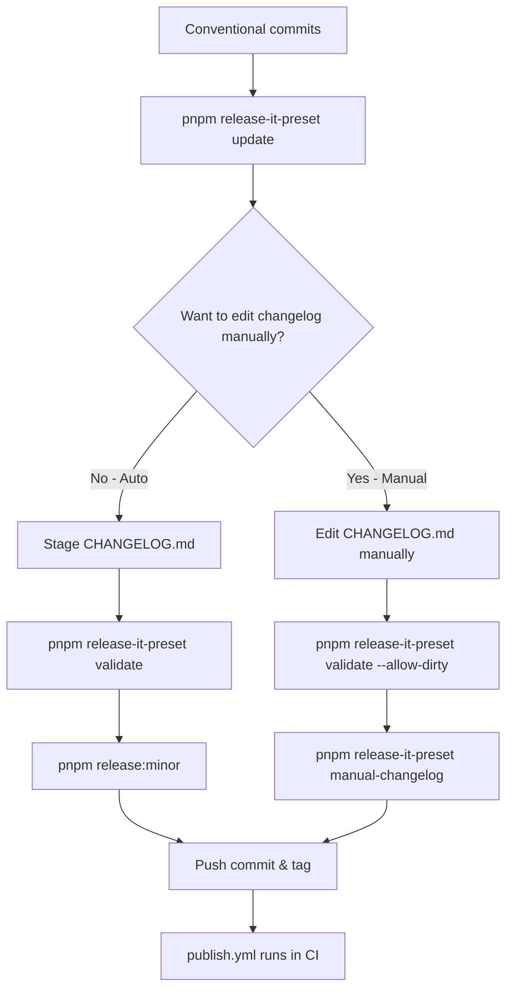

# Usage Reference

This is the complete reference for `@oorabona/release-it-preset`. For the 30-second quick start, see [README.md](../README.md).

---

## Table of Contents

- [Available Configurations](#available-configurations)
- [CLI Usage](#cli-usage)
  - [Zero-Config Mode](#zero-config-mode-auto-detection)
  - [Preset Selection Mode](#preset-selection-mode)
  - [Passthrough Mode](#passthrough-mode-custom-config-override)
  - [Monorepo Support](#monorepo-support)
  - [Composing with @release-it-plugins/workspaces](#composing-with-release-it-pluginsworkspaces)
  - [Utility Commands](#utility-commands)
  - [pnpm Script Shortcuts](#pnpm-script-shortcuts)
- [Scripts Reference](#scripts-reference)
- [Environment Variables](#environment-variables)
- [Configuration Modes](#configuration-modes)
- [Release Workflow](#release-workflow)
- [GitHub Actions Workflows](#github-actions-workflows)
- [Best Practices](#best-practices)
- [Security](#security)
- [Troubleshooting](#troubleshooting)
- [Exit Codes](#exit-codes)

---

## Available Configurations

### `default` - Standard Release

Full-featured release with changelog, git operations, and optional GitHub/npm publishing.

**CLI:**
```bash
pnpm release-it-preset default
```

**Extends:**
```json
{
  "extends": "@oorabona/release-it-preset/config/default"
}
```

Features:
- Version bumping (interactive)
- Automatic changelog population from conventional commits
- Git commit, tag, and push
- GitHub release creation (set `GITHUB_RELEASE=true`)
- npm publishing with provenance (set `NPM_PUBLISH=true`)

---

### `hotfix` - Emergency Hotfix

For urgent patches that need quick changelog generation from git log (GitHub/npm remain opt-in).

**CLI:**
```bash
pnpm release-it-preset hotfix
```

**Extends:**
```json
{
  "extends": "@oorabona/release-it-preset/config/hotfix"
}
```

Features:
- Forced patch version increment
- Automatic changelog from recent commits
- Pre-bump unreleased section population
- GitHub release with extracted notes (set `GITHUB_RELEASE=true`)
- npm publishing with provenance (set `NPM_PUBLISH=true`)

---

### `changelog-only` - Changelog Preparation

Updates changelog without performing a release (useful in CI or pre-release).

**CLI:**
```bash
pnpm release-it-preset changelog-only --ci
```

**Extends:**
```json
{
  "extends": "@oorabona/release-it-preset/config/changelog-only"
}
```

Features:
- Populates `[Unreleased]` section
- No version bump, no git operations, no publishing

---

### `manual-changelog` - Manual Changelog Release

For releases where you've manually edited the `[Unreleased]` section in CHANGELOG.md. Skips automatic changelog generation while keeping GitHub/npm steps opt-in.

**Workflow:**
```bash
# 1. Generate initial changelog
pnpm release-it-preset update

# 2. Manually edit CHANGELOG.md [Unreleased] section

# 3. Release without regenerating changelog
pnpm release-it-preset manual-changelog
```

**Extends:**
```json
{
  "extends": "@oorabona/release-it-preset/config/manual-changelog"
}
```

Features:
- Version bumping (interactive)
- Preserves manual `[Unreleased]` edits
- Moves `[Unreleased]` to versioned section
- Git commit, tag, and push
- GitHub release creation (set `GITHUB_RELEASE=true`)
- npm publishing with provenance (set `NPM_PUBLISH=true`)
- Skips automatic changelog population

---

### `no-changelog` - Quick Release

Standard release without changelog updates; GitHub/npm steps remain opt-in.

**CLI:**
```bash
pnpm release-it-preset no-changelog
```

**Extends:**
```json
{
  "extends": "@oorabona/release-it-preset/config/no-changelog"
}
```

Features:
- Version bumping
- Git operations
- GitHub releases (set `GITHUB_RELEASE=true`)
- npm publishing (set `NPM_PUBLISH=true`)
- No changelog updates

---

### `republish` - Git Tag Move + GitHub Release Update

**DANGER:** Moves an existing git tag to HEAD and updates the GitHub release notes (breaks semver immutability for that tag).

Only use when you need to fix a broken release that requires moving the git tag. This preset **does not publish to npm** — npm immutability (since 2016) makes republishing an existing version impossible under any dist-tag. See [ADR 0005](adr/0005-republish-scope-narrowing.md).

Alternatives:
- **dist-tag change** (e.g. move `latest` to a different version): `npm dist-tag add @oorabona/release-it-preset@<version> latest`
- **Retry a failed npm/GitHub publish:** use the `retry-publish` preset instead

**CLI:**
```bash
pnpm release-it-preset republish
```

Features:
- Moves existing git tag
- Updates changelog for current version
- Updates GitHub release (set `GITHUB_RELEASE=true`)
- Does not publish to npm (npm immutability)

---

### `retry-publish` - Retry Failed Publishing

Retries npm/GitHub publishing for an existing tag without modifying git history; opt in to each surface via `NPM_PUBLISH` and `GITHUB_RELEASE`.

**CLI:**
```bash
# Step 1: Run pre-flight checks (optional)
pnpm release-it-preset retry-publish-preflight

# Step 2: Retry the publish
pnpm release-it-preset retry-publish
```

Features:
- Republishes to npm (set `NPM_PUBLISH=true`)
- Updates GitHub release (set `GITHUB_RELEASE=true`)
- No version increment, no git operations

---

## CLI Usage

The package provides a `release-it-preset` CLI with four operating modes:

1. **Zero-Config Mode** — auto-detection, no arguments needed
2. **Preset Selection Mode** — specify which preset to use
3. **Passthrough Mode** — direct config file override
4. **Utility Mode** — helper commands

### Zero-Config Mode (Auto-Detection)

The CLI can automatically detect which preset to use from your `.release-it.json`:

```bash
# Just run release-it-preset with no arguments
pnpm release-it-preset

# Auto-detected preset: default
# Config validated: preset "default"
# Using: /path/to/.release-it.json
```

**How it works:**
1. CLI reads your `.release-it.json`
2. Extracts the preset name from the `extends` field
3. Runs that preset automatically

**Requirements:**
- `.release-it.json` must exist
- Must have `extends` field like `"@oorabona/release-it-preset/config/default"`

### Preset Selection Mode

Run release-it with specific configurations:

```bash
pnpm release-it-preset --help
pnpm release-it-preset default --dry-run
pnpm release-it-preset hotfix --verbose
pnpm release-it-preset changelog-only --ci
pnpm release-it-preset manual-changelog
```

All additional arguments are passed through to release-it.

### Passthrough Mode (Custom Config Override)

Use a custom config file and bypass preset validation:

```bash
pnpm release-it-preset --config .release-it-manual.json
```

**Use cases:**
- Switching presets occasionally — keep multiple config files for different scenarios
- Monorepo workflows — reference shared configs from parent directories
- Advanced customization — full control over release-it configuration

**Example workflow:**

```json
// .release-it.json (default - 95% of time)
{
  "extends": "@oorabona/release-it-preset/config/default",
  "git": { "requireBranch": "develop" }
}

// .release-it-manual.json (rare - 5% of time)
{
  "extends": "@oorabona/release-it-preset/config/manual-changelog",
  "git": { "requireBranch": "develop" }
}
```

```bash
pnpm release-it-preset                              # Auto-detects default
pnpm release-it-preset --config .release-it-manual.json  # Manual override
```

### Monorepo Support

Parent directory config references are supported:

```
/my-monorepo/
├── .release-it-base.json        # Shared configuration
├── packages/
│   ├── core/
│   │   └── .release-it.json     # extends: ../../.release-it-base.json
│   └── utils/
│       └── .release-it.json     # extends: ../../.release-it-base.json
```

```json
// packages/core/.release-it.json
{
  "extends": [
    "../../.release-it-base.json",
    "@oorabona/release-it-preset/config/default"
  ]
}
```

**Security validation:**
- Parent directory references (`../`) supported (up to 5 levels)
- Config file extension whitelist (`.json`, `.js`, `.cjs`, `.mjs`, `.yaml`, `.yml`, `.toml`)
- File existence validation
- Absolute paths blocked (use relative paths)
- Excessive traversal blocked (max `../../../../../../`)

See [examples/monorepo-workflow.md](../examples/monorepo-workflow.md) for the complete monorepo guide and [examples/monorepo/](../examples/monorepo/) for a runnable workspace demo.

### Composing with `@release-it-plugins/workspaces`

This preset focuses on a single package per release-it run. If your monorepo needs **bulk publish** (iterate over every workspace package + sync cross-package dependency versions), compose this preset with [`@release-it-plugins/workspaces`](https://github.com/release-it-plugins/workspaces).

```bash
pnpm add -D @oorabona/release-it-preset @release-it-plugins/workspaces release-it@^19
```

```jsonc
// .release-it.json
{
  "extends": "@oorabona/release-it-preset/config/default",
  "plugins": {
    "@release-it-plugins/workspaces": true
  }
}
```

**Peer compatibility note:** `@release-it-plugins/workspaces` v5.0.3 declares peer `release-it ^17 || ^18 || ^19`. The intersection with this preset's `^19 || ^20` is `^19`, so when composing with the workspaces plugin you must pin release-it to v19. v20 standalone is recommended for new projects.

When this composition is right for you:
- You release multiple packages with **synchronized versions** (all bumped together)
- You want **cross-package dependency sync** (when `pkg-a` bumps to 2.0, `pkg-b`'s reference auto-updates)

When our preset alone is enough:
- **Independent versioning** per package (each releases when ready). Use `GIT_CHANGELOG_PATH=packages/<pkg>` to scope the CHANGELOG.

### Utility Commands

#### `init` - Initialize Project

Creates CHANGELOG.md, .release-it.json, and optionally adds scripts to package.json and scaffolds GitHub Actions workflows:

```bash
# Interactive mode
pnpm release-it-preset init

# Non-interactive mode (skip prompts, use defaults)
pnpm release-it-preset init --yes

# Also scaffold a GitHub Actions publish workflow
pnpm release-it-preset init --yes --with-workflows

# Use a custom workflow filename (default: release.yml)
pnpm release-it-preset init --yes --with-workflows --workflow-name=publish.yml
```

**What it does:**
- Creates `CHANGELOG.md` with Keep a Changelog template
- Creates `.release-it.json` with extends configuration
- Optionally adds release scripts to `package.json`
- Optionally scaffolds `.github/workflows/release.yml` for OIDC trusted publishing
- Skips existing files in `--yes` mode

> One-off usage: `pnpm dlx @oorabona/release-it-preset init`

#### `update` - Update Changelog

Updates the `[Unreleased]` section with commits since last tag:

```bash
pnpm release-it-preset update
```

**What it does:**
- Parses conventional commits since last git tag
- Groups commits by type (Added, Fixed, Changed, Deprecated, Removed, Security)
- Updates `[Unreleased]` section in CHANGELOG.md
- Generates commit links to repository
- Uses only the conventional commit subject; edit CHANGELOG.md afterwards if you want to add detail from the commit body

#### `validate` - Validate Release Readiness

Checks if project is ready for release:

```bash
pnpm release-it-preset validate
pnpm release-it-preset validate --allow-dirty
```

**What it checks:**
- CHANGELOG.md exists and is well-formatted
- `[Unreleased]` section has content
- Working directory is clean (unless `--allow-dirty`)
- npm authentication works (`npm whoami`)
- Current branch is allowed (if `GIT_REQUIRE_BRANCH` is set)

Exit code 0 if all checks pass, 2 if precondition not met (CI-friendly).

#### `doctor` - Release Readiness Diagnostic

Runs a structured checklist across four categories and outputs a readiness score:

```bash
pnpm release-it-preset doctor
pnpm release-it-preset doctor --json
```

| Category | Checks |
|----------|--------|
| Environment | Known env vars, source (env / default / unset), publish-mode consistency |
| Repository | Git repo presence, branch vs `GIT_REQUIRE_BRANCH`, latest tag, commit count, dirty WD, upstream tracking, remote URL |
| Configuration | `CHANGELOG.md` exists + Keep a Changelog format + `[Unreleased]` content, `.release-it.json` parseable + `extends` field, `package.json` valid semver version, `release-it` peer range satisfied, `release-it` major version advisor |
| Readiness Summary | `PASS`/`WARN`/`FAIL` counts, score `N/M checks passing`, status (`READY`/`WARNINGS`/`BLOCKED`), actionable recommendations |

**Exit codes:**
- `0` — status is `READY` or `WARNINGS`
- `1` — status is `BLOCKED` (at least one `FAIL`)

**`--json` output shape:**
```json
{
  "environment": { "checks": [], "vars": [], "status": "PASS" },
  "repository":  { "checks": [], "status": "WARN" },
  "configuration": { "checks": [], "status": "PASS" },
  "summary": {
    "pass": 10, "warn": 2, "fail": 0, "total": 12,
    "score": "10/12 checks passing",
    "status": "WARNINGS",
    "recommendations": ["Review 2 warning(s) before releasing"]
  }
}
```

#### `check` - Diagnostic Information

Displays configuration and project status (full verbose dump):

```bash
pnpm release-it-preset check
```

Shows: environment variables, repository info (URL, branch, remote), git tags and latest version, commits since last tag, configuration files status, npm authentication status.

#### `check-pr` - Pull Request Hygiene

Evaluates PR readiness by analysing commits and changelog changes. Designed for CI usage:

```bash
PR_BASE_REF=origin/main PR_HEAD_REF=HEAD pnpm release-it-preset check-pr
```

Outputs JSON summaries for workflows (base64 encoded) and prints a human-readable report.

#### `retry-publish-preflight` - Retry Safety Checks

Verifies that the latest tag exists, matches `package.json`, and that there are no unexpected workspace changes before attempting a retry:

```bash
pnpm release-it-preset retry-publish-preflight
```

Use this before calling `pnpm release-it-preset retry-publish` when recovering from a failed publish.

### pnpm Script Shortcuts

After `init`, your `package.json` will include:

- `pnpm release:patch` / `release:minor` / `release:major` → bump + commit + tag + push
- `pnpm release:dry` → dry-run the default release configuration
- `pnpm changelog:update` → populate `[Unreleased]` section
- `pnpm release:validate` → run release validation checks

The root `package.json` of this repository also demonstrates a fuller set of shortcuts — feel free to copy any subset into your own project.

---

## Scripts Reference

Scripts are authored in TypeScript but distributed as compiled ESM JavaScript in `dist/scripts`. Invoke them via the CLI or pnpm aliases; the CLI automatically prefers the compiled build and falls back to `tsx` for local development.

### `populate-unreleased-changelog.ts`

Populates the `[Unreleased]` section with commits since the last tag using conventional commits.

Supported commit types:
- `feat`, `feature`, `add` → Added
- `fix`, `bugfix` → Fixed
- `deprecate`, `deprecated`, `deprecation` → Deprecated
- `perf`, `refactor`, `style`, `docs`, `test`, `chore`, `build` → Changed
- `remove`, `removed`, `delete`, `deleted` → Removed
- `security` → Security
- `ci`, `release`, `hotfix` → Ignored

Add `[skip-changelog]` to a commit message to exclude it.

### `extract-changelog.ts`

Extracts the changelog entry for a specific version (used automatically by the release notes generator):

```bash
node node_modules/@oorabona/release-it-preset/dist/scripts/extract-changelog.js 1.2.3
```

### `republish-changelog.ts`

Moves `[Unreleased]` content to the current version entry (for republishing).

### `retry-publish.ts`

Performs pre-flight checks before retrying a failed publish.

---

## Environment Variables

### Changelog

- `CHANGELOG_FILE` — Changelog file path (default: `CHANGELOG.md`)
- `GIT_CHANGELOG_PATH` — Optional. Restrict changelog generation to commits touching this repository-relative path (e.g. `packages/tar-xz`). Useful for monorepo per-package CHANGELOG files. Empty / unset = repository-wide.
- `GIT_CHANGELOG_SINCE` — Optional. Override the `since` baseline for changelog generation (any git ref: SHA, tag, branch). When set, bypasses both the per-package release-commit detection and the `git describe --tags` fallback.
- `CHANGELOG_TYPE_MAP` — Optional. JSON string mapping commit types to CHANGELOG section headings. Merged on top of `.changelog-types.json` (if present) and the built-in defaults. Use `false` as a value to suppress a type. Example: `CHANGELOG_TYPE_MAP='{"ops":"### Operations","deps":"### Dependencies"}'`.

### Custom type map (`.changelog-types.json`)

Create a `.changelog-types.json` file in your project root to override or extend the built-in commit-type → section mapping at the project level.

**Resolution order** (highest priority wins):
1. `CHANGELOG_TYPE_MAP` env var (runtime override, e.g. in CI)
2. `.changelog-types.json` project file
3. Built-in defaults

**Example `.changelog-types.json`:**
```json
{
  "deps": "### Dependencies",
  "ops": "### Operations",
  "ci": false
}
```

String values must be a valid `### Section Heading`. `false` suppresses the type. Malformed JSON or invalid values → warning logged, layer ignored.

**BREAKING CHANGE footer parsing** (Conventional Commits 1.0.0 §6): `BREAKING CHANGE:` is recognised as a footer only when it appears after a blank-line separator from the preceding paragraph. Multiple `BREAKING CHANGE:` lines each emit a separate entry under `### ⚠️ BREAKING CHANGES`.

### Git

- `GIT_COMMIT_MESSAGE` — Commit message template. Defaults vary per preset: `chore(release): v${version}` (`default`), `chore(hotfix): v${version}` (`hotfix`), `chore: republish v${version}` (`republish`).
- `GIT_TAG_NAME` — Tag name template (default: `v${version}`)
- `GIT_REQUIRE_BRANCH` — Required branch (default: `main`)
- `GIT_REQUIRE_UPSTREAM` — Require upstream tracking (default: `false`)
- `GIT_REQUIRE_CLEAN` — Require clean working directory (default: `false`)
- `GIT_REMOTE` — Git remote name (default: `origin`)
- `GIT_CHANGELOG_COMMAND` — Override the git log command used for previews
- `GIT_CHANGELOG_DESCRIBE_COMMAND` — Override the latest-tag detection command (default: `git describe --tags --abbrev=0`)

### GitHub

- `GITHUB_RELEASE` — Enable GitHub releases (default: `false`)
- `GITHUB_REPOSITORY` — Repository in `owner/repo` format (auto-detected from git remote)

### npm

- `NPM_PUBLISH` — Enable npm publishing (default: `false`)
- `NPM_SKIP_CHECKS` — Skip npm checks (default: `false`)
- `NPM_ACCESS` — npm access level (default: `public`)
- `NPM_TAG` — Optional. When set, appends `--tag <value>` to npm publish (e.g. `legacy-v0.10.0`). Prevents overwriting `latest` when republishing older versions.

### Hotfix

- `HOTFIX_INCREMENT` — Increment kind for the `hotfix` preset (default: `patch`). Accepts any release-it increment value (`patch`, `minor`, `major`, or explicit version).

> By default, the presets skip GitHub releases and npm publishing. Set `GITHUB_RELEASE=true` and/or `NPM_PUBLISH=true` in the environment (typically in CI) when you are ready to perform those steps.

**Example:**
```bash
CHANGELOG_FILE="HISTORY.md" \
GIT_REQUIRE_BRANCH="develop" \
GIT_REQUIRE_CLEAN="true" \
pnpm release
```

---

## Configuration Modes

### Mode 1: Direct Preset Usage (No Config File)

**When to use:** Simple projects, trust preset defaults, or customize only via environment variables.

Don't create `.release-it.json`. Just run the CLI:

```bash
pnpm release-it-preset default
```

### Mode 2: Preset + User Overrides (Recommended)

**When to use:** Customize specific options while keeping preset defaults.

Create `.release-it.json` **with the `extends` field**:

```json
{
  "extends": "@oorabona/release-it-preset/config/default",
  "git": {
    "requireBranch": "master",
    "commitMessage": "chore: release v${version}"
  }
}
```

**How it works:**
- The `extends` field loads the preset
- release-it merges your overrides on top via c12
- Your values take precedence over preset defaults
- CLI validates that `extends` is present; mismatched preset name warns and uses the invoked preset's config for that run

| Scenario | Recommended Mode |
|----------|-----------------|
| Quick start, minimal config | Mode 1 (No config file) |
| Customize branch/commit/hooks | Mode 2 (Config with extends) |
| Environment-only customization | Mode 1 (Use env vars) |
| Monorepo with per-package config | Mode 2 (Each package has own config) |

### Configuration Validation

If `.release-it.json` is missing the `extends` field, the CLI emits an error explaining the required format. If you invoke a preset different from your `.release-it.json`'s extends value, the CLI warns and uses the invoked preset's config for that run (your `.release-it.json` customizations are ignored).

---

## Release Workflow

### Recommended Workflow (Hybrid — Local + CI)

**Local (Developer):**

1. Make changes and commit with conventional commits
2. Run `pnpm release-it-preset update` to populate `[Unreleased]` from commits
3. Review `CHANGELOG.md`:

   **Option A: Quick release with auto-generated changelog**
   - Stage `CHANGELOG.md` as-is
   - Run `pnpm release-it-preset validate` to verify readiness
   - Dry-run with `pnpm release:dry`
   - Execute `pnpm release:minor` (or `:patch` / `:major`) to perform the release

   **Option B: Manual changelog editing (for detailed release notes)**
   - Manually edit `CHANGELOG.md` `[Unreleased]` section
   - Run `pnpm release-it-preset validate --allow-dirty`
   - Dry-run with `pnpm release-it-preset manual-changelog --dry-run`
   - Execute `pnpm release-it-preset manual-changelog` (skips regeneration, preserves edits)

   **If you change your mind mid-release:** Answer **No** at the commit prompt, then press Ctrl+C. Edit `CHANGELOG.md`, then run `manual-changelog`. Or re-run `pnpm release` and select the same version — `--allow-same-version` makes this safe.

4. GitHub releases and npm publish are skipped locally by default. Enable with environment variables or let `publish.yml` handle both after the tag push.

**CI (GitHub Actions):**
- When tag is pushed, CI publishes to npm with provenance via the `retry-publish` preset.



### Why This Workflow?

- **Single CI entry point** — Tag pushes run the `retry-publish` preset, which updates the GitHub release and publishes to npm with provenance in one command.
- **Local runs stay safe** — Without `GITHUB_RELEASE=true` or `NPM_PUBLISH=true`, the presets only handle changelog updates, commits, and tags.
- **Better security** — Publishing requires CI credentials (GITHUB_TOKEN + NPM_TOKEN), keeping local environments token-free by default.
- **Predictable outputs** — Release notes are regenerated from the committed changelog, avoiding drift between local runs and CI.

---

## GitHub Actions Workflows

### Reusable Workflows

#### `reusable-verify.yml` - PR Validation & Hygiene Checks

Validates TypeScript compilation, runs tests, checks release readiness, and evaluates PR hygiene.

**Example usage:**

```yaml
# .github/workflows/validate-pr.yml
name: PR Validation

on:
  pull_request:
    types: [opened, synchronize, reopened]

jobs:
  validate:
    uses: oorabona/release-it-preset/.github/workflows/reusable-verify.yml@main
    with:
      node-version: '20'
      base-ref: origin/${{ github.base_ref }}
      head-ref: ${{ github.sha }}
      run-tests: true
    secrets: inherit
```

**Inputs:**

| Input | Type | Default | Description |
|-------|------|---------|-------------|
| `node-version` | string | `'20'` | Node.js version to use |
| `run-tests` | boolean | `false` | Run `pnpm test` after compilation |
| `base-ref` | string | `''` | Base ref for diff comparisons (e.g., `origin/main`) |
| `head-ref` | string | `'HEAD'` | Head ref for comparisons |
| `install-args` | string | `'--frozen-lockfile'` | Additional pnpm install arguments |
| `fetch-depth` | number | `0` | Git fetch depth for checkout |

**Outputs:** `release_validation`, `changelog_status`, `skip_changelog`, `conventional_commits`, `commit_messages`, `changed_files`

#### `build-dist.yml` - Build Compiled Distribution

Builds TypeScript sources to `dist/` and uploads as artifact for reuse in other jobs.

```yaml
jobs:
  build:
    uses: oorabona/release-it-preset/.github/workflows/build-dist.yml@main
    with:
      artifact_name: my-dist
      ref: ${{ github.sha }}
```

### Publish on Tag (recommended setup)

```yaml
name: Publish

on:
  push:
    tags: ['v*']

permissions:
  contents: write
  id-token: write

jobs:
  publish:
    uses: oorabona/release-it-preset/.github/workflows/publish.yml@main
```

This triggers `retry-publish --ci`, creates/updates the GitHub Release with changelog, and publishes to npm with provenance attestation. No `NPM_TOKEN` secret needed — uses OIDC trusted publishing.

### Workflow Reference

| Workflow | Type | Trigger | Purpose |
|----------|------|---------|---------|
| `reusable-verify.yml` | Reusable | `workflow_call` | PR validation & hygiene checks |
| `build-dist.yml` | Reusable | `workflow_call` | Build TypeScript distribution |
| `ci.yml` | Standalone | Push, PR, Manual | Continuous Integration |
| `validate-pr.yml` | Standalone | PR | Pull request validation |
| `hotfix.yml` | Manual | `workflow_dispatch` | Emergency hotfix releases |
| `retry-publish.yml` | Manual | `workflow_dispatch` | Retry failed publishing |
| `republish.yml` | Manual | `workflow_dispatch` | Republish existing version (DANGER) |
| `publish.yml` | Reusable | Tag push, `workflow_call` | Automated publishing |

#### `hotfix.yml` - Emergency Hotfix Release

Manual trigger (`workflow_dispatch`).

| Input | Type | Default | Description |
|-------|------|---------|-------------|
| `increment` | choice | `patch` | Version bump: `patch` or `minor` |
| `commit` | string | latest | Specific commit SHA to release |
| `dry_run` | boolean | `false` | Test without actual publishing |

#### `retry-publish.yml` - Retry Failed Publishing

Manual trigger. Use when a previous publish failed (network issue, auth problem, etc.).

| Input | Type | Default | Description |
|-------|------|---------|-------------|
| `tag_name` | string | latest tag | Git tag to republish |
| `npm_only` | boolean | `false` | Publish to npm only |
| `github_only` | boolean | `false` | Create GitHub Release only |

#### `republish.yml` - Republish (EXCEPTIONAL)

**DANGER:** Moves existing git tag (breaks semver immutability). Requires confirmation phrase: `"I understand the risks"`. Includes 10-second safety delay. Only for exceptional emergencies where a published version must be moved to a different commit.

#### `publish.yml` - Unified Publish

Triggered on tag push (`v*`), `workflow_call`, or `workflow_dispatch`. Optional `npm_only` / `github_only` inputs scope a partial replay. Uses npm OIDC trusted publishing.

**Manual replay:**
```bash
gh workflow run publish.yml --ref main -f tag=vX.Y.Z
```

---

## Best Practices

1. **Use conventional commits** — enables automatic changelog generation
2. **Keep `[Unreleased]` updated** — run `pnpm release-it-preset update` regularly or before releases
3. **Validate before releasing** — run `pnpm release-it-preset doctor` to catch issues early
4. **Test releases** — use `--dry-run` flag to test without publishing
5. **Protect main branch** — require PR reviews before merging
6. **Use CI for publishing** — let GitHub Actions handle GitHub releases and npm publishing with provenance
7. **Local runs are for prep** — keep local runs focused on changelog, versioning, and tagging unless you explicitly opt in to publish

---

## Security

This preset implements OWASP security best practices:

### Input Validation

All CLI inputs are validated before execution:
- **Whitelist validation:** Config names and commands are validated against allowed lists
- **Argument sanitization:** All arguments are checked for dangerous characters (`;`, `&`, `|`, `` ` ``, `$()`, etc.)
- **Path traversal protection:** File paths are validated to prevent directory traversal attacks

### Command Injection Prevention

- All `spawn()` calls use `shell: false` to prevent command injection
- Arguments are passed as arrays, not concatenated strings
- No user input is ever executed in a shell context

---

## Troubleshooting

### Changelog not updating

```bash
pnpm release-it-preset update
```

### GitHub releases failing

Ensure you have a `GITHUB_TOKEN` with `repo` scope and opt in to GitHub releases:
```bash
GITHUB_RELEASE=true GITHUB_TOKEN=your_token pnpm release-it-preset default
```

### npm publish failing in CI

Check that:
1. `NPM_TOKEN` secret is set in repository settings (or OIDC trusted publishing is configured)
2. Token is an **automation token** (not a publish token)
3. Token has permission to publish the package
4. Package name is available

Remember to export `NPM_PUBLISH=true` (and `GITHUB_RELEASE=true` if you expect a GitHub release).

```bash
pnpm release-it-preset check  # Check npm auth status
npm whoami                     # Verify authentication
```

### Validation failing

```bash
pnpm release-it-preset check
```

Common issues:
- Working directory not clean → commit or stash changes, or use `--allow-dirty`
- `[Unreleased]` section empty → run `pnpm release-it-preset update`
- Not on required branch → checkout correct branch or update `GIT_REQUIRE_BRANCH`

### `npm error Version not changed`

This appears if you interrupt a release, tweak `CHANGELOG.md`, then retry with the same version. The preset automatically passes `--allow-same-version` to `npm version`, so simply re-run `pnpm release` and select the same version — npm will no longer abort.

---

## Exit Codes

The CLI follows this convention (stable from v1.0.0 onward):

| Code | Meaning | Examples |
|---|---|---|
| `0` | Success | Command completed; `doctor` `READY` or `WARNINGS` status |
| `1` | General failure | Unhandled error, validation failure, `doctor` `BLOCKED` status |
| `2` | Precondition failure (CI-friendly) | `validate` reports CHANGELOG missing or `[Unreleased]` empty |
| `3..9` | Reserved | Not currently emitted |

In CI scripts, distinguish `exit 1` (try-again-friendly) from `exit 2` (precondition not met — require operator action) when chaining commands.

---

## Borrowing Scripts & Workflows

- The root `package.json` of this repository shows how to expose convenient `pnpm run release:*` shortcuts. Copy any subset into your own project.
- The GitHub Actions workflows under `.github/workflows/*.yml` illustrate how to wire the CLI into CI. They are safe to reuse — review the permissions/secrets section and adapt branch names or triggers to your process.

📖 **[Reusable Workflows Examples](../examples/reusable-workflows.md)** | 📚 **[CI/CD Integration Examples](../examples/ci-integration.md)** | 🏢 **[Monorepo Workflow Guide](../examples/monorepo-workflow.md)**
